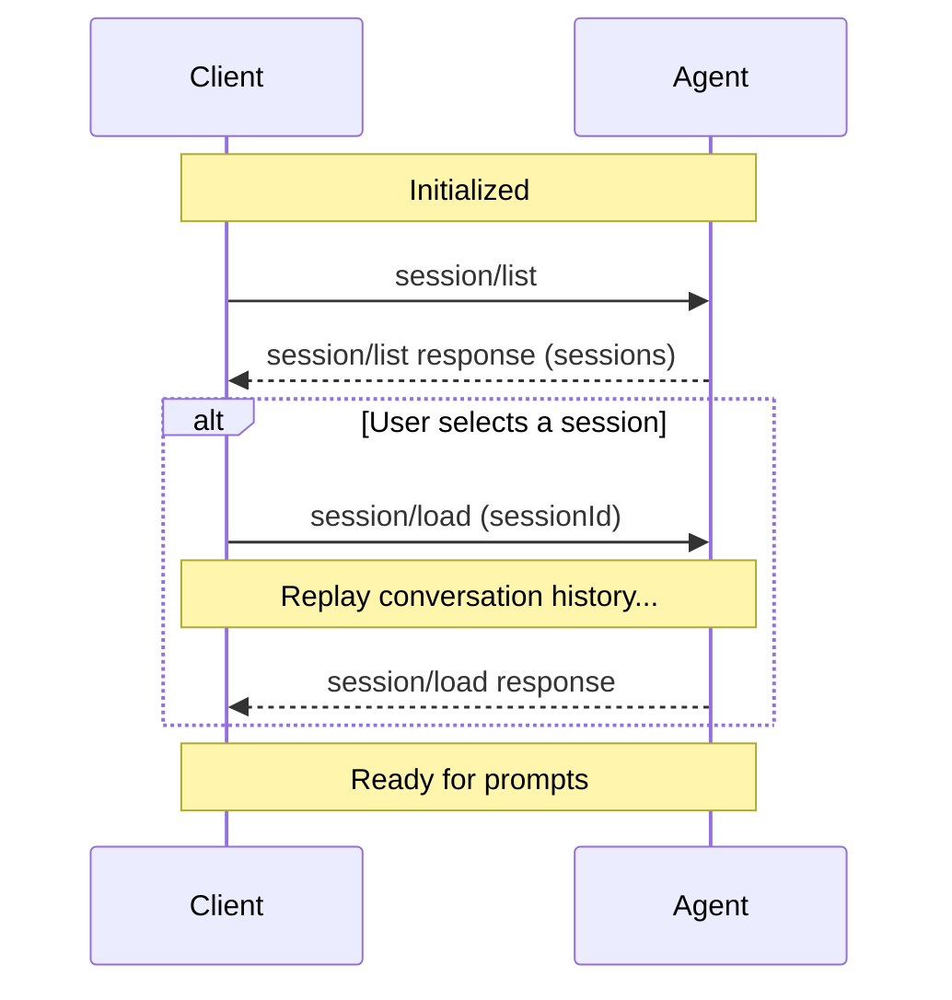

The `session/list` method allows Clients to discover and enumerate sessions known to an Agent. Clients can use this to display session history and switch between sessions.

Agents can also push session metadata updates to Clients in real-time via the `session_info_update` notification, keeping session titles and metadata in sync without polling.

Before listing sessions, Clients **MUST** first complete the [initialization](../initialization) phase to verify the Agent supports this capability.

<br />



<br />

## Checking Support

Before attempting to list sessions, Clients **MUST** verify that the Agent supports this capability by checking the `sessionCapabilities.list` field in the `initialize` response:

```json highlight={7-9}
{
  "jsonrpc": "2.0",
  "id": 0,
  "result": {
    "protocolVersion": 1,
    "agentCapabilities": {
      "sessionCapabilities": {
        "list": {}
      }
    }
  }
}
```

If `sessionCapabilities.list` is not present, the Agent does not support listing sessions and Clients **MUST NOT** attempt to call `session/list`.

## Listing Sessions

Clients discover existing sessions by calling the `session/list` method with optional filtering and pagination parameters:

```json
{
  "jsonrpc": "2.0",
  "id": 2,
  "method": "session/list",
  "params": {
    "cwd": "/home/user/project",
    "cursor": "eyJwYWdlIjogMn0="
  }
}
```

All parameters are optional. A request with an empty `params` object returns the first page of sessions.

<ParamField path="cwd" type="string">
  Filter sessions by working directory. Must be an absolute path. Only sessions
  with a matching `cwd` are returned.
</ParamField>

<ParamField path="cursor" type="string">
  Opaque cursor token from a previous response's `nextCursor` field for
  cursor-based pagination. See [Pagination](#pagination).
</ParamField>

The Agent **MUST** respond with a list of sessions and optional pagination metadata:

```json
{
  "jsonrpc": "2.0",
  "id": 2,
  "result": {
    "sessions": [
      {
        "sessionId": "sess_abc123def456",
        "cwd": "/home/user/project",
        "title": "Implement session list API",
        "updatedAt": "2025-10-29T14:22:15Z",
        "_meta": {
          "messageCount": 12,
          "hasErrors": false
        }
      },
      {
        "sessionId": "sess_xyz789ghi012",
        "cwd": "/home/user/another-project",
        "title": "Debug authentication flow",
        "updatedAt": "2025-10-28T16:45:30Z"
      },
      {
        "sessionId": "sess_uvw345rst678",
        "cwd": "/home/user/project",
        "updatedAt": "2025-10-27T15:30:00Z"
      }
    ],
    "nextCursor": "eyJwYWdlIjogM30="
  }
}
```

<ResponseField name="sessions" type="SessionInfo[]" required>
  Array of session information objects.

  <Expandable title="SessionInfo">
    <ResponseField name="sessionId" type="string" required>
      Unique identifier for the session.
    </ResponseField>
    <ResponseField name="cwd" type="string" required>
      Working directory for the session. Always an absolute path.
    </ResponseField>
    <ResponseField name="title" type="string">
      Human-readable title for the session. May be auto-generated from the first prompt.
    </ResponseField>
    <ResponseField name="updatedAt" type="string">
      ISO 8601 timestamp of the last activity in the session.
    </ResponseField>
    <ResponseField name="_meta" type="object">
      Agent-specific metadata. See [Extensibility](../extensibility).
    </ResponseField>
  </Expandable>
</ResponseField>

<ResponseField name="nextCursor" type="string">
  Opaque cursor token. If present, pass this in the next request's `cursor`
  parameter to fetch the next page. If absent, there are no more results.
</ResponseField>

When no sessions match the criteria, the Agent **MUST** return an empty `sessions` array.

## Pagination

`session/list` uses cursor-based pagination. The request includes an optional `cursor`, and the response includes `nextCursor` when more results are available.

- Clients **MUST** treat a missing `nextCursor` as the end of results
- Clients **MUST** treat cursors as opaque tokens — do not parse, modify, or persist them
- Agents **SHOULD** return an error if the cursor is invalid
- Agents **SHOULD** enforce reasonable page sizes internally

## Updating Session Metadata

Agents can update session metadata in real-time by sending a `session_info_update` notification via `session/update`. This follows the same pattern as other session notifications like [`available_commands_update`](../slash-commands) and [`current_mode_update`](../session-modes).

```json
{
  "jsonrpc": "2.0",
  "method": "session/update",
  "params": {
    "sessionId": "sess_abc123def456",
    "update": {
      "sessionUpdate": "session_info_update",
      "title": "Implement user authentication",
      "_meta": {
        "tags": ["feature", "auth"],
        "priority": "high"
      }
    }
  }
}
```

All fields are optional. Only include fields that have changed — omitted fields are left unchanged.

<ResponseField name="title" type="string | null">
  Human-readable title for the session. Set to `null` to clear.
</ResponseField>

<ResponseField name="updatedAt" type="string | null">
  ISO 8601 timestamp of last activity. Set to `null` to clear.
</ResponseField>

<ResponseField name="_meta" type="object">
  Agent-specific metadata. See [Extensibility](../extensibility).
</ResponseField>

The `sessionId` and `cwd` fields are **not** included in the update — `sessionId` is already in the notification's `params`, and `cwd` is immutable (set during [`session/new`](../session-setup#creating-a-session)). Agents typically send this notification after the first meaningful exchange to auto-generate a title.

## Interaction with Other Session Methods

`session/list` is a discovery mechanism only — it does **not** restore or modify sessions:

1. Client calls `session/list` to discover available sessions
2. User selects a session from the list
3. Client calls [`session/load`](../session-setup#loading-sessions) with the chosen `sessionId` to resume the conversation
