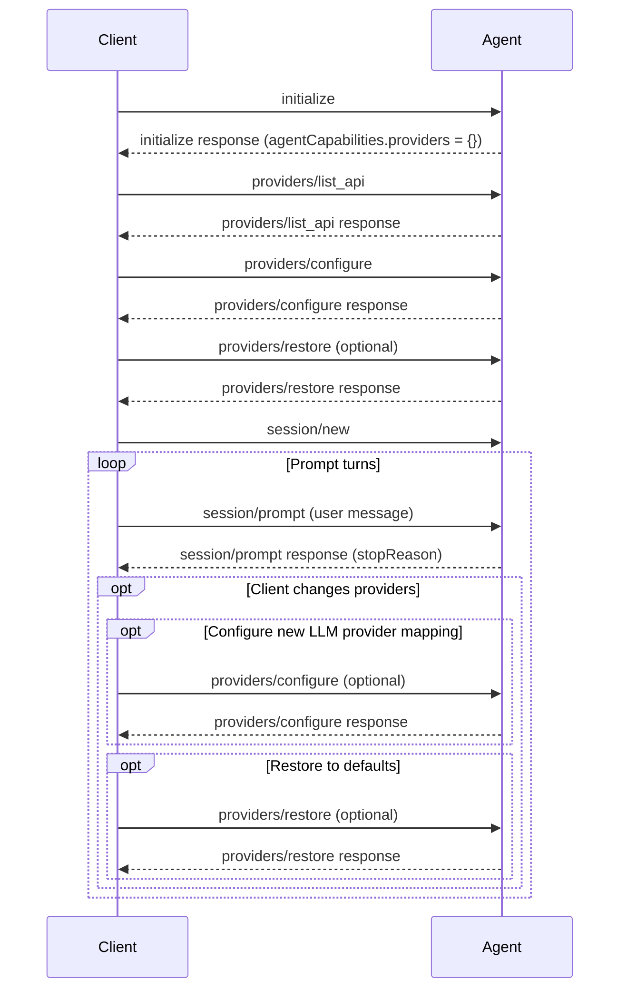

- Author(s): [@anna239](https://github.com/anna239), [@xtmq](https://github.com/xtmq), [@vadim-briliantov](https://github.com/Ololoshechkin)

## Elevator pitch

> What are you proposing to change?

Add the ability for clients to discover and configure agent LLM providers (identified by API type) via dedicated provider methods:

- `providers/list_api`
- `providers/configure`
- `providers/restore`

This allows clients to route LLM requests through their own infrastructure (proxies, gateways, or self-hosted models) without agents needing to know about this configuration in advance.

## Status quo

> How do things work today and what problems does this cause? Why would we change things?

ACP does not currently define a standard method for configuring LLM providers.

In practice, provider configuration is usually done via environment variables or agent-specific config files. That creates several problems:

- No standard way for clients to discover what provider APIs an agent supports/exposes
- No standard way to configure custom LLM provider connections for all (or some) of the supported LLM provider APIs
- No standard way to disable a specific provider at runtime while preserving provider discoverability
- Secret-bearing values in headers are difficult to handle safely when configuration must be round-tripped

This particularly affects:

- **Client proxies**: clients want to route agent traffic through their own proxies, for example to add headers or logging
- **Enterprise deployments**: organizations want to route LLM traffic through internal gateways for compliance, logging, and cost controls
- **Self-hosted models**: users running local servers (vLLM, Ollama, etc.) need to redirect agent traffic to local infrastructure
- **API gateways**: organizations using multi-provider routing, rate limiting, and caching need standardized endpoint configuration

## Shiny future

> How will things play out once this feature exists?

Clients will be able to:

1. Understand whether an agent supports client-managed LLM routing
2. See where the agent is currently sending LLM requests (for example in settings UI)
3. Route agent LLM traffic through their own infrastructure (enterprise proxy, gateway, self-hosted stack)
4. Update routing settings from the client instead of relying on agent-specific env vars
5. Disable a provider when needed and later re-enable it explicitly
6. Apply these settings before starting new work in sessions

## Implementation details and plan

> Tell me more about your implementation. What is your detailed implementation plan?

### Intended flow


```mermaid
sequenceDiagram
    participant Client
    participant Agent

    Client->>Agent: initialize
    Agent-->>Client: initialize response (agentCapabilities.providers = {})

    Client->>Agent: providers/list_api
    Agent-->>Client: providers/list_api response

    Client->>Agent: providers/configure
    Agent-->>Client: providers/configure response

    Client->>Agent: providers/restore (optional)
    Agent-->>Client: providers/restore response

    Client->>Agent: session/new

    loop Prompt turns
        Client->>Agent: session/prompt (user message)
        Agent-->>Client: session/prompt response (stopReason)

        opt Client changes providers
            opt Configure new LLM provider mapping
                Client->>Agent: providers/configure (optional)
                Agent-->>Client: providers/configure response
            end
            opt Restore to defaults
                Client->>Agent: providers/restore (optional)
                Agent-->>Client: providers/restore response
            end
        end
    end
```

1. Client initializes and checks `agentCapabilities.providers`.
2. Client calls `providers/list_api` to discover supported provider APIs (protocol types), and whether they are required.
3. Client calls `providers/configure` to apply new (required) configuration for a set of specific providers.
4. Client may call `providers/restore` when some set of LLM providers must be restored to defaults.
5. Client creates or loads sessions.
6. A client can then send `providers/configure` or `providers/restore` anytime
7. Then, after starting a new turn in any of the active sessions (there might be multiple sessions in parallel), agent starts using updated providers list.

### Capability advertisement

The agent advertises support with an empty object capability:

```typescript
interface AgentCapabilities {
  // ... existing fields ...

  /**
   * Provider configuration support.
   * If present, the agent supports providers/list, providers/set, and providers/disable.
   */
  providers?: {};
}
```

If `providers` is absent, clients must treat provider methods as unsupported.

### Types

```typescript
/**
 * Well-known API protocol identifiers for LLM providers.
 *
 * This is an open string type: agents and clients MUST handle unknown
 * protocol identifiers gracefully.
 *
 * Protocol names beginning with `_` are free for custom use, like other
 * ACP extension methods. Protocol names that do not begin with `_` are
 * reserved for the ACP spec.
 */
type LlmProtocol =
  "anthropic" | "openai" | "azure" | "vertex" | "bedrock" | string;

interface ProviderCurrentConfig {
  /** Name of the provider to be shown in UI. */
  presentableName: string;

  /** Base URL currently used by this provider. */
  baseUrl: string;
}

interface ProviderInfo {
  /** LLM protocol. */
  apiType: LlmProtocol;

  /** Name of the provider to be shown in UI. */
  presentableName: string;

  /**
   * Current effective non-secret routing config.
   * Null or omitted means provider is disabled.
   */
  current?: ProviderCurrentConfig | null;

  /** Extension metadata */
  _meta?: Record<string, unknown>;
}
```

### `providers/list_api`

```typescript
interface ProviderAPIListRequest {
  /** Extension metadata */
  _meta?: Record<string, unknown>;
}

interface ProviderAPIListResponse {
  /** Configurable providers with current routing info suitable for UI display. */
  providers: ProviderInfo[];

  /** Extension metadata */
  _meta?: Record<string, unknown>;
}
```

### `providers/set`

`providers/set` overrides (updates) the configuration for a set of providers.

```typescript
interface ProviderConfigUpdateReq {
  /** LLM protocol to configure. */
  apiProtocol: LlmProtocol;

  /** Name of the provider to be shown in UI. */
  presentableName: string;

  /** Base URL for requests sent through this provider. */
  baseUrl: string;

  /**
   * Full headers map for this provider.
   * May include authorization, routing, or other integration-specific headers.
   * Omitting this field is equivalent to an empty map (no headers).
   */
  headers?: Record<string, string>;

  /** Extension metadata */
  _meta?: Record<string, unknown>;
}

interface SetProvidersRequest {
  providerConfigurations: ProviderConfigUpdateReq[];

  /** Extension metadata */
  _meta?: Record<string, unknown>;
}

interface SetProvidersResponse {
  /** Extension metadata */
  _meta?: Record<string, unknown>;
}
```

### `providers/restore`

```typescript
interface RestoreProvidersRequest {
  /** List of API protocols to restore to default providers */
  apiProtocols: LlmProtocol[];

  /** Extension metadata */
  _meta?: Record<string, unknown>;
}

interface DisableProviderResponse {
  /** Extension metadata */
  _meta?: Record<string, unknown>;
}
```

### Example exchange

**initialize Response:**

```json
{
  "jsonrpc": "2.0",
  "id": 0,
  "result": {
    "protocolVersion": 1,
    "agentInfo": {
      "name": "MyAgent",
      "version": "2.0.0"
    },
    "agentCapabilities": {
      "providers": {},
      "sessionCapabilities": {}
    }
  }
}
```

**providers/list_api Request:**

```json
{
  "jsonrpc": "2.0",
  "id": 1,
  "method": "providers/list_api",
  "params": {}
}
```

**providers/list_api Response:**

```json
{
  "jsonrpc": "2.0",
  "id": 1,
  "result": {
    "providers": [
      {
        "apiType": "anthropic",
        "presentableName": "Anthropic",
        "current": {
          "presentableName": "Local Anthropic proxy",
          "baseUrl": "http://localhost/anthropic"
        }
      },
      {
        "apiType": "openai",
        "presentableName": "OpenAI",
        "current": null
      }
    ]
  }
}
```

**providers/configure Request:**

```json
{
  "jsonrpc": "2.0",
  "id": 2,
  "method": "providers/configure",
  "params": {
    "providerConfigurations": [
      {
        "apiProtocol": "anthropic",
        "presentableName": "Corporate Anthropic gateway",
        "baseUrl": "https://llm-gateway.corp.example.com/anthropic/v1",
        "headers": {
          "X-Request-Source": "my-ide"
        }
      },
      {
        "apiProtocol": "openai",
        "presentableName": "Corporate OpenAI gateway",
        "baseUrl": "https://llm-gateway.corp.example.com/openai/v1"
      }
    ]
  }
}
```

**providers/configure Response:**

```json
{
  "jsonrpc": "2.0",
  "id": 2,
  "result": {}
}
```

**providers/restore Request:**

```json
{
  "jsonrpc": "2.0",
  "id": 3,
  "method": "providers/restore",
  "params": {
    "apiProtocols": ["openai"]
  }
}
```

**providers/restore Response:**

```json
{
  "jsonrpc": "2.0",
  "id": 3,
  "result": {}
}
```

### Behavior

1. **Capability discovery**: agents that support provider methods MUST advertise `agentCapabilities.providers: {}` in `initialize`. Clients SHOULD only call `providers/*` when this capability is present.
2. **Timing and session impact**: provider methods MUST be called after `initialize`. Clients SHOULD configure providers before creating or loading sessions. Agents MAY choose not to apply changes to prompt turns that are already running, but MUST apply them starting from the next prompt turn in any active session and to sessions created or loaded after the change.
3. **List semantics**: `providers/list_api` returns the supported provider APIs (protocol types), their presentable names, and the current effective non-secret routing config (`current`). Providers SHOULD remain discoverable in the list after `providers/restore`, and while disabled.
4. **Disabled state encoding**: in `providers/list_api`, `current` omitted or `current: null` means the provider is disabled and MUST NOT be used by the agent for LLM calls.
5. **Configure semantics and validation**: `providers/configure` replaces the full configuration (`presentableName`, `baseUrl`, `headers`) for every `apiProtocol` listed in `providerConfigurations`; an omitted `headers` field is treated as an empty map. Providers whose protocols are not listed keep their current configuration. If any `apiProtocol` is unsupported by the agent or params are malformed, agents SHOULD return `invalid_params` and SHOULD NOT apply the update partially.
6. **Restore semantics**: `providers/restore` restores every listed `apiProtocol` to the agent's default configuration. If the agent has no default for a protocol, the provider becomes disabled (`current` omitted or `current: null` in `providers/list_api`). Restoring a protocol that is already at its default, or that is unknown to the agent, SHOULD be treated as success (idempotent behavior).
7. **Scope and persistence**: provider configuration is process-scoped and SHOULD NOT be persisted to disk.

## Frequently asked questions

> What questions have arisen over the course of authoring this document?

### What does `null` mean in `providers/list_api`?

`current` omitted or `current: null` means the provider is disabled.

When disabled, the agent MUST NOT route LLM calls through that provider until the client configures it again with `providers/configure`, or `providers/restore` brings back a default configuration for it.

### Why not a single `providers/update` method for full list replacement?

A full-list update means the client must send complete configuration (including `headers`) for all providers every time.

If the client wants to change only some providers, it may not know headers for the others. In that case it cannot safely build a correct full-list payload.

Also, `providers/list_api` does not return headers, so the client cannot simply "take what the agent returned" and send it back with one edit.

`providers/configure` accepts a subset of protocols and leaves the rest untouched, and `providers/restore` makes going back to defaults explicit. Together they avoid this problem and keep updates explicit.

### Why doesn't `providers/list_api` return headers?

Header values may contain secrets and should not be echoed by the agent. `providers/list_api` is intentionally limited to non-secret routing information (`current.presentableName`, `current.baseUrl`).

### Why are `providers/list_api` and `providers/configure` payloads different?

`providers/configure` accepts `headers`, including secrets, and is write-oriented.

`providers/list_api` is read-oriented and returns only non-secret routing summary (`current`) for UI and capability discovery.

### Why is this separate from `initialize` params?

Clients need capability discovery first, then provider discovery, then configuration. A dedicated method family keeps initialization focused on negotiation and leaves provider mutation to explicit steps.

### Why not use `session-config` with a `provider` category instead?

`session-config` is a possible alternative, and we may revisit it as the spec evolves.

We did not choose it as the primary approach in this proposal because provider routing here needs dedicated semantics that are difficult to express with today's session config model:

- Multiple providers identified by API protocol, each with its own lifecycle
- Structured payloads (`apiProtocol`, `presentableName`, `baseUrl`, full `headers` map) rather than simple scalar values
- Explicit discovery (`providers/list_api`) and restore-to-defaults (`providers/restore`) semantics

Today, `session-config` values are effectively string-oriented and do not define a standard multi-value/structured model for this use case.

## Revision history

- 2026-08-18: Reworked the API to be keyed by API protocol instead of provider `id`: `providers/list` renamed to `providers/list_api`, `providers/set` replaced by batch `providers/configure`, `providers/disable` replaced by `providers/restore` (restore protocols to agent defaults); dropped the `required` flag; added `presentableName` to `providerConfigurations` entries
- 2026-04-19: Made `ProviderInfo.current` optional in `providers/list`; disabled state may be encoded as omitted `current` or `current: null`
- 2026-03-22: Finalized provider disable semantics - `providers/remove` renamed to `providers/disable`, required providers are non-disableable, and disabled state is represented as `current: null`
- 2026-03-21: Initial draft of provider configuration API (`providers/list`, `providers/set`, `providers/remove`)
- 2026-03-07: Rename "provider" to "protocol" to reflect API compatibility level; make `LlmProtocol` an open string type with well-known values; resolve open questions on identifier standardization and model availability
- 2026-03-04: Revised to use dedicated `setLlmEndpoints` method with capability advertisement
- 2026-02-02: Initial draft - preliminary proposal to start discussion
