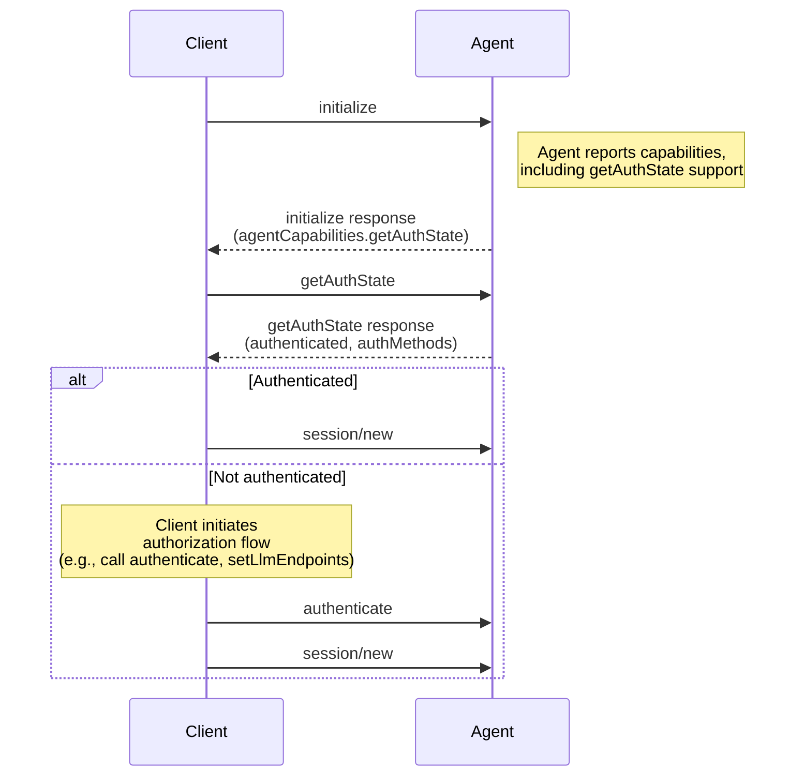

- Author(s): [@xtmq](https://github.com/xtmq)

## Elevator pitch

> What are you proposing to change?

Add a `getAuthState` method and corresponding capability that allows clients to query the agent's current authentication state. This lets clients determine whether the agent is already configured with valid credentials or requires authorization before creating a session, without relying on the ambiguous error behavior of `session/new`.

## Status quo

> How do things work today and what problems does this cause? Why would we change things?

Currently, there is no dedicated way for a client to determine whether an agent has valid authentication configured. The typical workaround is:

1. Call `initialize`
2. Call `session/new`
3. If the agent has no credentials, it _may_ return an authorization error
4. The client handles the error and initiates an authorization flow

This approach has significant problems:

- **Unreliable detection**: The `session/new` method is not required by the specification to check authorization. Some agents validate credentials eagerly, others do so lazily (e.g., on the first LLM call). The client cannot rely on `session/new` to consistently surface auth issues.
- **Wasted resources**: Creating a session only to discard it on auth failure is wasteful, especially if session creation has side effects (resource allocation, logging, history file creation, etc.).
- **Poor user experience**: The client cannot proactively guide the user through authorization before session creation. Instead, users encounter errors mid-flow.

## Shiny future

> How will things play out once this feature exists?

Clients will be able to:

1. Discover whether an agent supports auth state queries via capabilities during initialization
2. Query the agent's current authentication state immediately after initialization
3. Make an informed decision about whether to proceed with session creation, initiate an authorization flow, or configure endpoints (e.g., via `setLlmEndpoints`)
4. Provide clear, proactive UX — e.g., showing a "Sign in" prompt before any session is created
5. Completely skip authentication process if the agent is already authenticated

## Implementation details and plan

> Tell me more about your implementation. What is your detailed implementation plan?

### Intended flow

The client calls `initialize`, inspects capabilities to confirm `getAuthState` support, then queries auth state before deciding how to proceed.



1. **Initialization**: The client calls `initialize`. The agent responds with capabilities, including `getAuthState` if supported.
2. **Auth state query**: The client calls `getAuthState`. The agent inspects its local configuration, stored credentials, or environment to determine the current auth state.
3. **Client-side decision**: Based on the response, the client either proceeds to session creation or initiates an authorization flow first.

### Capability advertisement

The agent advertises support for the `getAuthState` method via a new capability in `agentCapabilities`:

```typescript
interface AgentCapabilities {
  // ... existing fields ...

  /**
   * Auth state query support.
   * If true, the agent supports the getAuthState method.
   */
  getAuthState?: boolean;
}
```

**Initialize Response example:**

```json
{
  "jsonrpc": "2.0",
  "id": 0,
  "result": {
    "protocolVersion": 1,
    "agentInfo": {
      "name": "MyAgent",
      "version": "2.0.0"
    },
    "agentCapabilities": {
      "getAuthState": true,
      "sessionCapabilities": {}
    }
  }
}
```

### `getAuthState` method

A method that can be called after initialization to query the agent's current authentication state.

```typescript
interface AuthMethodState {
  /**
   * The ID of the authentication method.
   * Corresponds to an `id` from the `authMethods` array returned during initialization.
   */
  authMethodId: string;

  /**
   * Whether the agent has credentials configured for this auth method.
   * true means credentials are present (validity is not guaranteed).
   */
  authenticated: boolean;

  /** Human-readable description of the auth state (e.g., "API key configured via environment") */
  message?: string;

  /** Extension metadata */
  _meta?: Record<string, unknown>;
}

interface GetAuthStateRequest {
  /** Extension metadata */
  _meta?: Record<string, unknown>;
}

interface GetAuthStateResponse {
  /**
   * Whether the agent has credentials configured.
   * true means credentials are present (validity is not guaranteed).
   * false means no credentials are configured.
   */
  authenticated: boolean;

  /**
   * Optional per-auth-method breakdown of auth state.
   * Each entry corresponds to an auth method from the `authMethods` array
   * returned during initialization.
   */
  authMethods?: AuthMethodState[];

  /** Human-readable description of the overall auth state */
  message?: string;

  /** Extension metadata */
  _meta?: Record<string, unknown>;
}
```

#### JSON Schema Additions

```json
{
  "$defs": {
    "AuthMethodState": {
      "description": "Authentication state for a specific auth method.",
      "properties": {
        "authMethodId": {
          "type": "string",
          "description": "The ID of the authentication method, matching an entry from the authMethods array returned during initialization."
        },
        "authenticated": {
          "type": "boolean",
          "description": "Whether credentials are configured for this auth method."
        },
        "message": {
          "type": ["string", "null"],
          "description": "Human-readable description of the auth state."
        },
        "_meta": {
          "additionalProperties": true,
          "type": ["object", "null"]
        }
      },
      "required": ["authMethodId", "authenticated"],
      "type": "object"
    },
    "GetAuthStateResponse": {
      "description": "Response to getAuthState method.",
      "properties": {
        "authenticated": {
          "type": "boolean",
          "description": "Whether the agent has credentials configured."
        },
        "authMethods": {
          "type": ["array", "null"],
          "description": "Per-auth-method state breakdown.",
          "items": {
            "$ref": "#/$defs/AuthMethodState"
          }
        },
        "message": {
          "type": ["string", "null"],
          "description": "Human-readable description of the overall auth state."
        },
        "_meta": {
          "additionalProperties": true,
          "type": ["object", "null"]
        }
      },
      "required": ["authenticated"],
      "type": "object"
    }
  }
}
```

#### Example Exchange

**getAuthState Request:**

```json
{
  "jsonrpc": "2.0",
  "id": 1,
  "method": "getAuthState",
  "params": {}
}
```

**getAuthState Response (authenticated):**

```json
{
  "jsonrpc": "2.0",
  "id": 1,
  "result": {
    "authenticated": true,
    "authMethods": [
      {
        "authMethodId": "anthropic-api-key",
        "authenticated": true,
        "message": "API key configured via local config"
      }
    ]
  }
}
```

**getAuthState Response (unauthenticated):**

```json
{
  "jsonrpc": "2.0",
  "id": 1,
  "result": {
    "authenticated": false,
    "message": "No credentials configured. Please provide API keys or configure an LLM endpoint."
  }
}
```

#### Behavior

1. **Capability advertisement**: The agent SHOULD include `getAuthState` in `agentCapabilities` if it supports the `getAuthState` method. Clients MUST check for this capability before calling the method.

2. **Timing**: The `getAuthState` method MUST be callable after `initialize`. It MAY be called multiple times (e.g., after `authenticate`, to re-check state).

3. **Local checks only**: The agent MAY determine auth state based on locally available information (config files, environment variables, stored tokens) or by making external API calls. `authenticated: true` means credentials are present, NOT that they are guaranteed to be valid.

4. **No side effects**: Calling `getAuthState` MUST NOT modify any agent state. It is a pure query.

5. **Per-auth-method breakdown**: The `authMethods` field is optional. Agents that support multiple authentication methods MAY include per-method state to help clients make fine-grained decisions.

## Open questions

### Is a per-auth-method breakdown needed, or is an aggregate state sufficient?

The current design includes an optional `authMethods` field with per-auth-method state. However, for many agents a single aggregate `state` may be enough. A per-method breakdown adds complexity to both the agent implementation and client logic. Should we simplify to just the top-level `state` and `message`?

## Frequently asked questions

> What questions have arisen over the course of authoring this document?

### Why not rely on `session/new` errors?

The `session/new` method is designed for session creation, not for auth validation. Per the specification, agents are not required to validate credentials during session creation — some agents defer validation to the first actual LLM call. This means a successful `session/new` does not guarantee the agent is authenticated, and a failed `session/new` may fail for reasons unrelated to authentication. A dedicated method provides a clear, unambiguous signal.

### Why not include auth state in the `initialize` response directly?

The `initialize` response contains capabilities — what the agent _supports_. Auth state is runtime information — what the agent _currently has configured_. Mixing these concerns would make `initialize` less predictable. Additionally, auth state may change after initialization (e.g., after a `setLlmEndpoints` call), and a separate method allows re-querying.

### Why not just check for the presence of environment variables on the client side?

Agents may obtain credentials from many sources: config files, keychains, OAuth tokens, environment variables, or even embedded keys. The client has no visibility into these mechanisms. Only the agent knows whether it has usable credentials configured.

## Revision history

- 2026-03-07: Address review feedback, replace per-provider breakdown with per-auth-method
- 2026-03-05: Initial draft — preliminary proposal to start discussion
