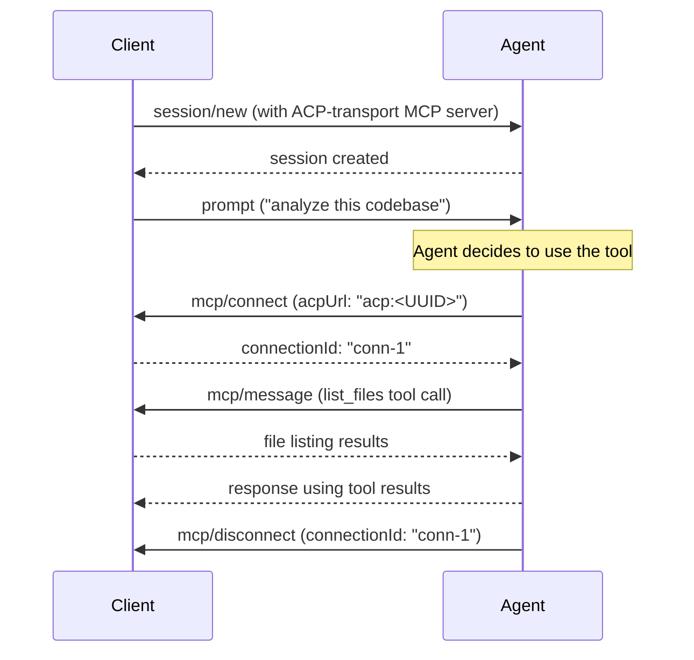
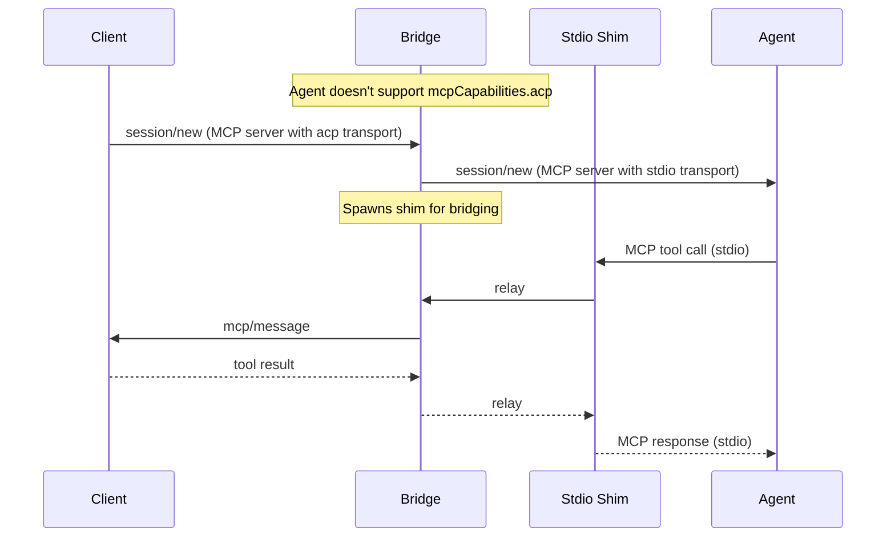

Author(s): [nikomatsakis](https://github.com/nikomatsakis)

## Elevator pitch

> What are you proposing to change?

Add support for MCP servers that communicate over ACP channels instead of stdio or HTTP. This enables any ACP component to provide MCP tools and handle callbacks through the existing ACP connection, without spawning separate processes or managing additional transports.

## Status quo

> How do things work today and what problems does this cause? Why would we change things?

MCP (Model Context Protocol) defines how agents interact with tool servers. MCP has two fundamental limitations in its current form:

**The agent controls the MCP server lifecycle.** The agent decides when to spawn MCP servers and when to invoke tools. Clients and proxies that want to provide tools must configure the agent to use them - they can't inject tools dynamically based on conversation context or project state.

**MCP servers must be separate binaries.** With stdio transport, MCP servers run as child processes. With HTTP transport, they run as separate services. There's no way to have a unified component that both injects context into prompts *and* provides an MCP server running in the same address space. This forces artificial separation between "things that modify prompts" and "things that provide tools."

These limitations create friction for components that want to provide tools dynamically:

**For clients**: A client that wants to inject project-specific tools into an agent session must either:
- Spawn a separate MCP server process and configure the agent to connect to it
- Hope the agent has built-in support for the specific tools needed

**For proxies**: A proxy that intercepts agent communication and wants to provide context-aware tools faces the same challenge - it must spawn and manage a separate process just to handle MCP callbacks.

**For embedded scenarios**: WebAssembly-based components or sandboxed environments may not be able to spawn child processes at all, making stdio transport impossible.

The result is that providing MCP tools requires process management overhead, even when the tool logic lives in a component that's already connected via ACP.

## What we propose to do about it

> What are you proposing to improve the situation?

We propose adding `"acp"` as a new MCP transport type. When an ACP component (client or proxy) adds an MCP server with ACP transport to a session, tool invocations for that server are routed back through the ACP channel to the component that provided it.

This enables patterns like:

- A **client** that injects project-aware tools into every session and handles callbacks directly
- An **intermediary** that adds context-aware tools based on the conversation state
- A **bridge** that translates ACP-transport MCP servers to stdio for agents that don't support native ACP transport

### How it works

When a component adds an MCP server to a `session/new` request, it can specify `"transport": "acp"` with a UUID that identifies the server:

```json
{
  "tools": {
    "mcpServers": {
      "project-tools": {
        "transport": "acp",
        "uuid": "550e8400-e29b-41d4-a716-446655440000"
      }
    }
  }
}
```

The UUID is generated by the component providing the MCP server. When the agent invokes tools from this server, the messages are routed back through ACP to the component that owns that UUID. Agents advertise their ability to handle ACP transport via `mcpCapabilities.acp` in their `InitializeResponse`.

### Message flow example



## Shiny future

> How will things play out once this feature exists?

### Seamless tool injection

Components can provide tools without any process management. A Rust development environment could inject cargo-aware tools, a cloud IDE could inject deployment tools, and a security scanner could inject vulnerability checking - all through the same ACP connection they're already using.

### WebAssembly-based tooling

Components running in sandboxed environments (like WASM) can provide MCP tools without needing filesystem or process spawning capabilities. The ACP channel is their only interface, and that's sufficient.

### Transparent bridging

For agents that don't natively support ACP transport, intermediaries can transparently bridge: accepting MCP-over-ACP from clients and spawning stdio-based MCP servers that the agent can use normally. This provides backwards compatibility while allowing the ecosystem to adopt ACP transport incrementally.

## Implementation details and plan

> Tell me more about your implementation. What is your detailed implementation plan?

### Capability advertising

Agents advertise MCP-over-ACP support via the `mcpCapabilities` field in their `InitializeResponse`. This extends the existing MCP capabilities structure:

```json
{
  "capabilities": {
    "mcpCapabilities": {
      "http": false,
      "sse": false,
      "acp": true
    }
  }
}
```

When `mcpCapabilities.acp` is `true`, the agent can handle MCP servers declared with `"transport": "acp"` natively - it will send `mcp/connect`, `mcp/message`, and `mcp/disconnect` messages through the ACP channel.

Clients don't need to advertise anything - they simply check the agent's capabilities to determine whether bridging is needed.

**Bridging intermediaries**: An intermediary that provides bridging can present `mcpCapabilities.acp: true` to its clients regardless of whether the downstream agent supports it, handling bridging transparently (see [Bridging](#bridging-for-agents-without-native-support) below).

### MCP transport schema extension

We extend the MCP JSON schema to include ACP as a transport option:

```json
{
  "type": "object",
  "properties": {
    "transport": {
      "type": "string",
      "enum": ["stdio", "http", "acp"]
    }
  },
  "allOf": [
    {
      "if": { "properties": { "transport": { "const": "acp" } } },
      "then": {
        "properties": {
          "uuid": {
            "type": "string",
            "pattern": "^[0-9a-f]{8}-[0-9a-f]{4}-[0-9a-f]{4}-[0-9a-f]{4}-[0-9a-f]{12}$"
          }
        },
        "required": ["uuid"]
      }
    }
  ]
}
```

### Message reference

**Connection lifecycle:**

```json
// Establish MCP connection
{
  "method": "mcp/connect",
  "params": {
    "acpUrl": "acp:550e8400-e29b-41d4-a716-446655440000",
    "meta": { ... }
  }
}
// Response:
{
  "connectionId": "conn-123",
  "meta": { ... }
}

// Close MCP connection
{
  "method": "mcp/disconnect",
  "params": {
    "connectionId": "conn-123",
    "meta": { ... }
  }
}
```

**MCP message exchange:**

```json
// Send MCP message (bidirectional - works agent→client or client→agent)
{
  "method": "mcp/message",
  "params": {
    "connectionId": "conn-123",
    "method": "<MCP_METHOD>",
    "params": { ... },
    "meta": { ... }
  }
}
```

The inner MCP message fields (`method`, `params`) are flattened into the params object. Whether the wrapped message is a request or notification is determined by the presence of an `id` field in the outer JSON-RPC envelope, following JSON-RPC conventions.

### Routing by UUID

The `acpUrl` in `mcp/connect` uses the format `acp:<UUID>`. This UUID was provided by the component when it declared the MCP server in `session/new`. The receiving side uses this UUID to route messages to the correct handler.

When a component provides multiple MCP servers in a single session, each gets a unique UUID, enabling proper message routing.

### Connection multiplexing

Multiple connections to the same MCP server are supported - each `mcp/connect` returns a unique `connectionId`. This allows scenarios where an agent opens multiple concurrent connections to the same tool server.

### Bridging for agents without native support

Not all agents will support MCP-over-ACP natively. To maintain compatibility, it is possible to write a bridge that translates ACP-transport MCP servers to transports the agent does support.

**Bridging approaches:**

- **Stdio shim**: Spawn a small shim process that the agent connects to via stdio. The shim relays MCP messages to/from the ACP channel. This is the most compatible approach since all MCP-capable agents support stdio.

- **HTTP bridge**: Run a local HTTP server that the agent connects to. MCP messages are relayed to/from the ACP channel. This works for agents that prefer HTTP transport.

**How bridging works:**

When a client provides an MCP server with `"transport": "acp"`, and the agent doesn't advertise `mcpCapabilities.acp: true`, a bridge can:

1. Rewrite the MCP server declaration in `session/new` to use stdio or HTTP transport
2. Spawn the appropriate shim process or HTTP server
3. Relay messages between the shim and the ACP channel

From the agent's perspective, it's talking to a normal stdio/HTTP MCP server. From the client's perspective, it's handling MCP-over-ACP messages. The bridge handles the translation transparently.



A first implementation of this bridging exists in the `sacp-conductor` crate, part of the proposed new version of the [ACP Rust SDK](https://github.com/anthropics/rust-sdk).

## Frequently asked questions

> What questions have arisen over the course of authoring this document or during subsequent discussions?

### Why use UUIDs instead of server names?

Server names in `mcpServers` are chosen by whoever adds them to the session, and could potentially collide if multiple components add servers. UUIDs provide guaranteed uniqueness and allow the providing component to correlate incoming messages back to the correct session context.

This also avoids a potential deadlock: some agents don't return the session ID until after MCP servers have been initialized. Using a component-generated UUID avoids any dependency on agent-provided identifiers.

### How does this relate to proxy chains?

MCP-over-ACP is a transport mechanism that works independently of proxy chains. However, proxy chains are a natural use case: a proxy can inject MCP servers into sessions it forwards, handle the tool callbacks, and use the results to enhance its transformations.

See the [Proxy Chains RFD](./proxy-chains) for details on how MCP-over-ACP enables context-aware tooling.

### What if the agent doesn't support ACP transport?

See the [Bridging for agents without native support](#bridging-for-agents-without-native-support) section above. A bridge can transparently translate ACP-transport MCP servers to stdio or HTTP for agents that don't advertise `mcpCapabilities.acp` support.

### Can agents provide MCP servers to clients?

The protocol is symmetric - there's nothing preventing an agent from declaring MCP servers with ACP transport that the client would connect to. However, this is an unusual pattern; typically clients/proxies provide tools for agents to use, not the reverse.

### What about security?

MCP-over-ACP has the same trust model as regular MCP: you're allowing a component to handle tool invocations. The difference is transport, not trust. Components should only add MCP servers from sources they trust, same as with stdio or HTTP transport.

## Revision history

Split from proxy-chains RFD to enable independent use of MCP-over-ACP transport by any ACP component, not just proxies.
