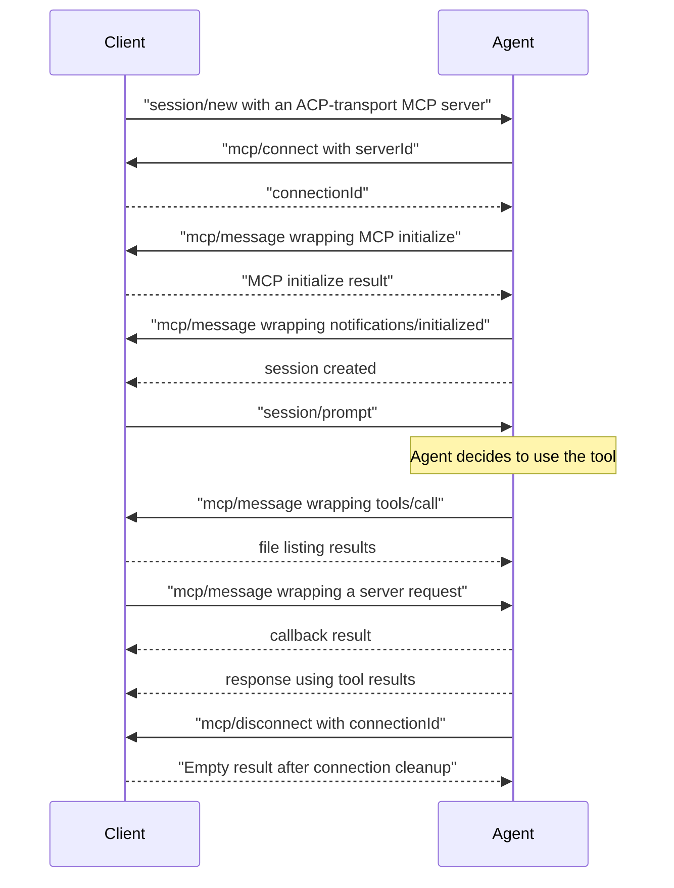
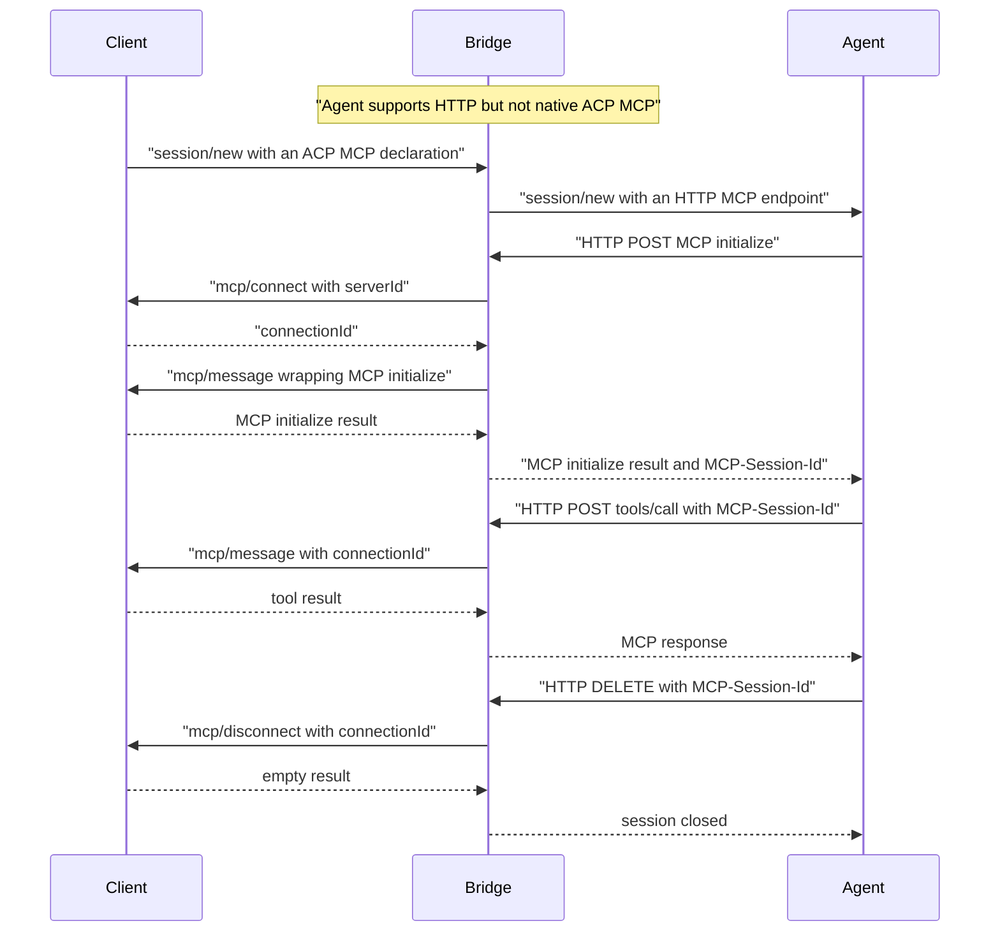

Author(s): [nikomatsakis](https://github.com/nikomatsakis)

**Revised target: MCP 2026-07-28 only.** The [modernization audit](#modernization-audit-mcp-2026-07-28) below defines the work needed for the latest, stateless MCP specification. The connection-oriented proposal and implementation notes preceding that audit are retained as a **work-in-progress checkpoint**, not the intended stabilized transport. In particular, the initialization handshake, reverse JSON-RPC requests, and stateful HTTP sessions described there must not become compatibility requirements. This transport is intended to supply new tools to agents; support for older MCP revisions is out of scope.

## Elevator pitch

> What are you proposing to change?

Add support for MCP servers that communicate over ACP channels instead of stdio or HTTP. This enables any ACP component to provide MCP tools and handle callbacks through the existing ACP connection, without spawning separate processes or managing additional transports.

## Status quo

> How do things work today and what problems does this cause? Why would we change things?

ACP and MCP each solve different halves of the problem of interacting with an agent. ACP stands in "front" of the agent, managing sessions, sending prompts, and receiving responses. MCP stands "behind" the agent, providing tools that the agent can use to do its work.

Many applications would benefit from being able to be both "in front" of the agent and "behind" it. This would allow a client, for example, to create custom MCP tools that are tailored to a specific request and which live in the client's address space.

The only way to combine ACP and MCP today is to use some sort of "backdoor", such as opening an HTTP port for the agent to connect to or providing a binary that communicates with IPC. This is inconvenient to implement but also means that clients cannot be properly abstracted and sandboxed, as some of the communication with the agent is going through side channels. Imagine trying to host an ACP component (client, agent, or [agent extension](./proxy-chains.mdx)) that runs in a WASM sandbox or even on another machine: for that to work, the ACP protocol has to encompass all of the relevant interactions so that messages can be transmitted properly.

## What we propose to do about it

> What are you proposing to improve the situation?

We propose adding `"acp"` as a new MCP transport type. When an ACP component (client or proxy) adds an MCP server with ACP transport to a session, tool invocations for that server are routed back through the ACP channel to the component that provided it.

This enables patterns like:

- A **client** that injects project-aware tools into every session and handles callbacks directly
- An **[agent extension](./proxy-chains.mdx)** that adds context-aware tools based on the conversation state
- A **bridge** that translates ACP-transport MCP servers to HTTP or stdio for agents that don't support native ACP transport

### How it works

When the client connects, the agent advertises MCP-over-ACP support in its `InitializeResponse` (see [Capability advertising](#capability-advertising) for the v1 and draft-v2 shapes). If supported, the client can add MCP servers to a `session/new` request with `"type": "acp"` and a `serverId` that identifies the server. For example, the session request parameters can include:

```json
{
  "cwd": "/workspace/project",
  "mcpServers": [
    {
      "type": "acp",
      "name": "project-tools",
      "serverId": "550e8400-e29b-41d4-a716-446655440000"
    }
  ]
}
```

The `serverId` is an opaque string generated by the component providing the MCP server; it need not be a UUID. The same declaration can be supplied to other session setup methods that accept `mcpServers`, such as `session/resume`.

When the agent connects to the MCP server, an `mcp/connect` request is sent with the MCP server's `serverId`. This returns a fresh `connectionId`. MCP messages are then sent back and forth using `mcp/message` requests and notifications. This includes the normal MCP initialization handshake: opening the transport does not initialize MCP itself. Finally, an `mcp/disconnect` request closes that connection.

`mcp/connect` and `mcp/disconnect` are initiated by the side connecting to the ACP-transport MCP server. In the direct client-provided server case, that means the agent sends them to the client. Once connected, `mcp/message` is bidirectional: the agent can send MCP client-originated requests to the server, and the server can send MCP server-originated requests or notifications back to the agent.

### Bridging and compatibility

For agents that don't support ACP transport for MCP servers, a wrapper component can translate between ACP-transport MCP servers and the stdio/HTTP transports that those agents support. The wrapper spawns shim processes or HTTP servers that the agent connects to normally, then relays messages to/from the ACP channel.

The Rust SDK implements HTTP adaptation as an explicit `McpOverAcpPolyfill` proxy from `agent-client-protocol-polyfill`, placed immediately before the final agent in a [proxy chain](./proxy-chains). It is not built into the conductor. The proxy advertises ACP MCP support upstream only when the downstream agent supports native ACP transport or the HTTP transport it can adapt to. Native support is passed through unchanged; a downstream agent supporting neither transport does not gain the capability.

### Message flow example

An agent may initialize MCP servers before returning the ACP session ID. Providers must therefore be ready to handle `mcp/connect` as soon as they publish the declaration, without waiting for `session/new` to finish.


```mermaid
sequenceDiagram
    participant Client
    participant Agent

    Client->>Agent: "session/new with an ACP-transport MCP server"
    Agent->>Client: "mcp/connect with serverId"
    Client-->>Agent: "connectionId"
    Agent->>Client: "mcp/message wrapping MCP initialize"
    Client-->>Agent: "MCP initialize result"
    Agent->>Client: "mcp/message wrapping notifications/initialized"
    Agent-->>Client: session created

    Client->>Agent: "session/prompt"

    Note over Agent: Agent decides to use the tool
    Agent->>Client: "mcp/message wrapping tools/call"
    Client-->>Agent: file listing results

    Client->>Agent: "mcp/message wrapping a server request"
    Agent-->>Client: callback result

    Agent-->>Client: response using tool results

    Agent->>Client: "mcp/disconnect with connectionId"
    Client-->>Agent: "Empty result after connection cleanup"
```

## Shiny future

> How will things play out once this feature exists?

### Seamless tool injection

Components can provide tools without any process management. A Rust development environment could inject cargo-aware tools, a cloud IDE could inject deployment tools, and a security scanner could inject vulnerability checking - all through the same ACP connection they're already using.

### WebAssembly-based tooling

Components running in sandboxed environments (like WASM) can provide MCP tools without needing filesystem or process spawning capabilities. The ACP channel is their only interface, and that's sufficient.

### Transparent bridging

For agents that don't natively support ACP transport, intermediaries can transparently bridge: accepting MCP-over-ACP from clients and spawning stdio- or HTTP-based MCP servers that the agent can use normally. This provides backwards compatibility while allowing the ecosystem to adopt ACP transport incrementally.

## Implementation details and plan

> Tell me more about your implementation. What is your detailed implementation plan?

### Capability advertising

The shared schema exposes this draft transport under the `unstable_mcp_over_acp` feature. Capability placement depends on the negotiated ACP version; the `mcp/*` envelopes below are the same in both versions.

In **v1**, agents advertise support with `agentCapabilities.mcpCapabilities.acp: true`. The relevant `InitializeResponse` fragment is:

```json
{
  "agentCapabilities": {
    "mcpCapabilities": {
      "acp": true
    }
  }
}
```

Omitting the v1 capability is equivalent to `false`.

In **draft v2**, capabilities use optional objects. The relevant `InitializeResponse` fragment is:

```json
{
  "capabilities": {
    "session": {
      "mcp": {
        "acp": {}
      }
    }
  }
}
```

The v2 `acp` field is optional and nullable: omission or `null` means support is not advertised, while `{}` advertises support. It is not a boolean. HTTP support follows the same optional-object convention in v2.

Advertising support means the receiving component can consume MCP servers declared with `"type": "acp"`. It will initiate `mcp/connect` and `mcp/disconnect` through the ACP channel, and both sides can exchange MCP payloads with `mcp/message`.

Clients don't need to advertise anything - they simply check the agent's capabilities to determine whether bridging is needed.

**Bridging intermediaries**: An intermediary may advertise ACP MCP support if it can actually adapt to a transport supported by its downstream agent. That capability describes the chain as seen upstream, not necessarily native support in the final agent (see [Bridging](#bridging-for-agents-without-native-support) below).

### MCP transport schema extension

We extend the MCP server JSON schema to include ACP as a transport option. `type`, `name`, and `serverId` are required and non-null. `_meta` is optional; omission and `null` both mean no additional metadata.

```json
{
  "type": "object",
  "properties": {
    "type": {
      "type": "string",
      "const": "acp"
    },
    "name": {
      "type": "string"
    },
    "serverId": {
      "type": "string"
    },
    "_meta": {
      "type": ["object", "null"]
    }
  },
  "required": ["type", "name", "serverId"]
}
```

### Message reference

**Open a connection:**

`mcp/connect` is a request, not a notification. Its required `serverId` selects the declared MCP server.

```json
{
  "jsonrpc": "2.0",
  "id": 20,
  "method": "mcp/connect",
  "params": {
    "serverId": "550e8400-e29b-41d4-a716-446655440000"
  }
}
```

The response returns the required identifier for the new connection:

```json
{
  "jsonrpc": "2.0",
  "id": 20,
  "result": {
    "connectionId": "conn-123"
  }
}
```

**Close a connection:**

`mcp/disconnect` is also a request. Its required `connectionId` identifies the connection to close, not the server declaration.

```json
{
  "jsonrpc": "2.0",
  "id": 21,
  "method": "mcp/disconnect",
  "params": {
    "connectionId": "conn-123"
  }
}
```

A successful response acknowledges connection cleanup:

```json
{
  "jsonrpc": "2.0",
  "id": 21,
  "result": {}
}
```

These lifecycle request parameters and response results may also contain an optional `_meta` object. Omission and `null` are equivalent. Both identifier fields are non-null strings.

**MCP message exchange:**

`mcp/message` is bidirectional. Either side can send the following request or notification shape on an established `connectionId`.

```json
{
  "jsonrpc": "2.0",
  "id": 123,
  "method": "mcp/message",
  "params": {
    "connectionId": "conn-123",
    "method": "tools/list",
    "params": {}
  }
}
```

The response carries the inner MCP result directly:

```json
{
  "jsonrpc": "2.0",
  "id": 123,
  "result": {
    "tools": []
  }
}
```

A notification has no outer request ID and receives no response:

```json
{
  "jsonrpc": "2.0",
  "method": "mcp/message",
  "params": {
    "connectionId": "conn-123",
    "method": "notifications/tools/list_changed"
  }
}
```

The inner MCP message fields (`method`, `params`) are flattened into the outer params object alongside the required `connectionId`. The inner `method` is a required non-null string. The inner `params` field is optional and accepts an object or `null`, not positional arrays; omission and `null` both mean the inner MCP message has no params.

Whether the wrapped message is a request or notification is determined by the presence of an `id` field in the outer JSON-RPC envelope. The envelope does not carry a second, nested MCP request ID. For requests, the ACP response result is the inner MCP result payload, and inner MCP errors use the outer JSON-RPC error response, preserving their code, message, and optional data.

An optional `_meta` object alongside `connectionId` is ACP envelope metadata; omission and `null` are equivalent. It is separate from any MCP `_meta` inside the inner `params` or result.

### Routing by ID

The `serverId` in `mcp/connect` matches the `serverId` supplied in the MCP server declaration. The receiving side uses it to route the connection request to the provider.

Providers must not reuse a server ID for different MCP servers visible on the same ACP connection, even across different ACP sessions. The same server may be offered to multiple sessions using the same server ID. A `connectionId` identifies one active connection to that server and is used for all subsequent messages.

### Connection multiplexing

Multiple connections to the same MCP server are supported: every successful `mcp/connect` returns a fresh `connectionId`. Each connection has its own MCP initialization and request state. Closing one connection must not close another connection to the same server or the containing ACP connection.

### Connection lifetime

A successful `mcp/connect` response means the provider is ready to route messages for that connection. Both sides must continue dispatching incoming ACP traffic while waiting for MCP responses, since the MCP server can issue a request back to the agent while handling an agent request.

`mcp/disconnect` stops accepting new messages for that connection, stops its underlying server/relay work, and releases its connection-scoped resources before acknowledging success. Outstanding requests on the closed connection must complete or fail rather than remain pending indefinitely. Messages for an unknown or disconnected connection cannot be delivered: requests receive an error, and notifications do not receive a response.

Closing the ACP transport releases all of its MCP connections. A disconnect exchange cannot be required after that transport is already gone. A failure in one MCP connection should be contained to that connection rather than terminating unrelated MCP or ACP work.

### Bridging for agents without native support

Not all agents will support MCP-over-ACP natively. To maintain compatibility, it is possible to write a bridge that translates ACP-transport MCP servers to transports the agent does support.

**Bridging approaches:**

- **Stdio shim**: Spawn a small shim process that the agent connects to via stdio. The shim relays MCP messages to/from the ACP channel. This works for agents that support stdio MCP servers.

- **HTTP bridge**: Run a local HTTP server that the agent connects to. MCP messages are relayed to/from the ACP channel. This works for agents that prefer HTTP transport.

**How bridging works:**

When a client provides an MCP server with `"type": "acp"`, and the agent doesn't advertise native ACP MCP support, a bridge can:

1. Rewrite the MCP server declaration in a session setup request to use a transport supported by the agent
2. Spawn the appropriate shim process or HTTP server
3. Open a native MCP connection when a logical MCP client session starts
4. Relay bidirectional requests and notifications between that client and the ACP channel
5. Disconnect that native connection when the logical MCP session ends, without affecting other sessions

From the agent's perspective, it's talking to a normal stdio/HTTP MCP server. From the client's perspective, it's handling MCP-over-ACP messages. The bridge handles the translation transparently.

An HTTP bridge may reuse a listening endpoint for a `serverId`, but the listener is not itself an MCP connection. Each independent HTTP MCP session needs its own `mcp/connect` and `connectionId`, so initialization, request IDs, and callbacks cannot cross between clients. A stateful HTTP adapter can identify these sessions using `MCP-Session-Id` and translate HTTP DELETE into `mcp/disconnect`. Closing an individual POST response or GET event stream does not close the logical session. HTTP session management is an adapter concern, not an additional ACP wire method.


```mermaid
sequenceDiagram
    participant Client
    participant Bridge
    participant Agent

    Note over Bridge: "Agent supports HTTP but not native ACP MCP"
    Client->>Bridge: "session/new with an ACP MCP declaration"
    Bridge->>Agent: "session/new with an HTTP MCP endpoint"

    Agent->>Bridge: "HTTP POST MCP initialize"
    Bridge->>Client: "mcp/connect with serverId"
    Client-->>Bridge: "connectionId"
    Bridge->>Client: "mcp/message wrapping MCP initialize"
    Client-->>Bridge: MCP initialize result
    Bridge-->>Agent: "MCP initialize result and MCP-Session-Id"

    Agent->>Bridge: "HTTP POST tools/call with MCP-Session-Id"
    Bridge->>Client: "mcp/message with connectionId"
    Client-->>Bridge: tool result
    Bridge-->>Agent: MCP response

    Agent->>Bridge: "HTTP DELETE with MCP-Session-Id"
    Bridge->>Client: "mcp/disconnect with connectionId"
    Client-->>Bridge: empty result
    Bridge-->>Agent: session closed
```

The [ACP Rust SDK](https://github.com/agentclientprotocol/rust-sdk) provides native MCP server attachment independently of proxy chains. Its `agent-client-protocol-polyfill` crate provides the explicit HTTP adapter described above; stdio adaptation remains a possible alternative, not a prerequisite for this proposal.

## Frequently asked questions

> What questions have arisen over the course of authoring this document or during subsequent discussions?

### Why use a separate `serverId` instead of server names?

Server names in `mcpServers` are chosen by whoever adds them to the session, and could potentially collide if multiple components add servers. A provider-generated `serverId` lets each component choose a unique routing identifier independently of its display name.

This also avoids a potential deadlock: some agents don't return the session ID until after MCP servers have been initialized. Using a provider-generated `serverId` avoids any dependency on agent-provided session identifiers.

The same field name is used in the declaration and `mcp/connect`. Earlier versions of this draft used `id` and `acpId`, respectively; `serverId` matches the shared schema and distinguishes the server from both an active `connectionId` and the outer JSON-RPC request `id`. Those earlier names are not aliases in the current wire schema.

### How does this relate to proxy chains?

MCP-over-ACP is a transport mechanism that works independently of proxy chains. However, proxy chains are a natural use case: a proxy can inject MCP servers into sessions it forwards, handle the tool callbacks, and use the results to enhance its transformations.

See the [Proxy Chains RFD](./proxy-chains) for details on how MCP-over-ACP enables context-aware tooling.

### What if the agent doesn't support ACP transport?

See the [Bridging for agents without native support](#bridging-for-agents-without-native-support) section above. A bridge can transparently translate ACP-transport MCP servers to stdio or HTTP for agents that don't advertise `mcpCapabilities.acp` support.

### What about security?

MCP-over-ACP has the same trust model as regular MCP: you're allowing a component to handle tool invocations. The difference is transport, not trust. Components should only add MCP servers from sources they trust, same as with stdio or HTTP transport.

## Modernization audit: MCP 2026-07-28

### Target and non-goals

The official MCP site identifies [2026-07-28](https://modelcontextprotocol.io/specification/2026-07-28) as the latest published specification, not a future draft. This proposal targets that revision only. Before stabilization, recheck the published revision and pin the chosen target explicitly rather than promising compatibility with an unbounded moving "latest."

There is no requirement to support legacy initialization, stateful HTTP, the deprecated HTTP+SSE transport, or fallback to an older MCP revision. MCP version selection is separate from ACP version selection: the existing v1/v2 ACP capability shapes do not require supporting two eras of MCP.

Stateless does not mean stateless tooling or an absence of open streams. The [base protocol](https://modelcontextprotocol.io/specification/2026-07-28/basic) forbids implicit request context inherited from a connection. Explicit tool arguments, opaque application handles, MRTR retry state, and state scoped to one long-lived request remain possible.

### Recommended transport design

Retain the provider-generated `serverId` in the declaration and route ordinary MCP requests directly to that server. Remove `mcp/connect`, `connectionId`, and `mcp/disconnect` from the proposed stabilized wire protocol unless a separate, demonstrated ACP routing need justifies them. A provider being reachable on an ACP connection is not an MCP session.

The replacement transport needs:

1. One independently valid MCP request, including its metadata, addressed to a declared `serverId`.
2. Request-scoped server notifications, followed by one final MCP result or error.
3. Explicit cancellation of one request or subscription without shutting down the server or other work.
4. Routing/cleanup scoped to the containing ACP connection and the lifetime of the server declaration, without carrying implicit MCP capabilities, identity, or authorization between requests.

The exact ACP request/notification schema and request-correlation mechanism remain design work. Reusing an ACP request ID as an MCP ID is not automatically safe: SDK relays can renumber outer JSON-RPC IDs, while MCP cancellation and subscription metadata refer to those IDs inside payloads. Either preserve an explicit logical MCP request identity or specify a complete mapping through every hop. Do not repurpose a connection ID as an unbounded session merely to correlate notifications.

This is a recommendation for the next wire-schema revision, not a claim that the current schema or SDK already implements it.

### Protocol changes to incorporate

1. **Initialization and discovery.** No `initialize` / `notifications/initialized`. Servers implement `server/discover`; clients may send ordinary requests without first discovering. Remove connection-opening handshakes and examples. Discovery is a tunneled MCP request, not a replacement ACP setup method.
2. **Per-request context.** Requests carry `io.modelcontextprotocol/protocolVersion` and `io.modelcontextprotocol/clientCapabilities` in their inner `params._meta`. Client identity is recommended, not authentication. Preserve these fields on every request and retry; never cache their meaning in a connection object or substitute outer ACP `_meta`. Return the modern unsupported-version error rather than falling back to legacy MCP.
3. **Results and input.** Results carry `resultType`. MRTR returns `input_required` and retries the original operation with `inputResponses` and any opaque `requestState`, using a fresh request ID. Replace examples of server-initiated RPC callbacks. Support MRTR for `tools/call`, `resources/read`, and `prompts/get`, not arbitrary methods. Preserve ordinary `complete` results and MCP error code/message/data.
4. **Subscriptions.** `subscriptions/listen` is a long-lived request. Its first message is `notifications/subscriptions/acknowledged`; notifications are filtered and tagged with `io.modelcontextprotocol/subscriptionId`. Define acknowledgement ordering, concurrent subscriptions, notification correlation, cancellation, and graceful completion on ACP. Do not implement a general unscoped server event channel.
5. **Request notifications.** Progress and any supported logging notifications belong to their originating request, not a subscription stream. Route them to the correct in-flight operation, stop them on completion/cancellation, and preserve progress tokens. Logging is deprecated and should not be a new dependency of the design.
6. **Cancellation and failure.** HTTP response-stream closure cancels that request. Stdio uses `notifications/cancelled`; broken HTTP streams are not resumable. Specify ACP cancellation rather than treating an entire ACP connection as the request stream. Settle pending work, suppress late messages, and use new request IDs for deliberate retries; do not silently replay side-effecting tool calls.
7. **Tool/resource/prompt catalogs.** Listings must not vary merely because a client uses a different connection. Cacheable results require `ttlMs` and `cacheScope`; deterministic tool order is recommended. Use explicit server identity and authorization scope for distinct offerings. Review registry filtering, list-change subscriptions, cache isolation, and cache-result constructors. Do not add per-connection tool catalogs.
8. **Tool schemas and output.** JSON Schema 2020-12 keywords and arbitrary JSON `structuredContent` are supported, with schema-reference and composition bounds. Preserve schema/output information in typed tool APIs. Opaque envelope forwarding alone is not sufficient evidence that the typed server helpers conform.
9. **Optional extensions.** Tasks are an opt-in `io.modelcontextprotocol/tasks` extension, not the old core task protocol. Preserve extension capability maps and payloads. Do not make a tasks implementation, MCP Apps, or other optional feature a prerequisite for this transport.
10. **Removed/deprecated features.** Removed features include `ping`, `logging/setLevel`, old resource subscription methods, and old completion notifications. Roots, Sampling, and Logging are deprecated. Do not build new transport APIs around these features. The modern elicitation/MRTR flow is the relevant interactive-tool example.

Normative sources: [versioning and discovery](https://modelcontextprotocol.io/specification/2026-07-28/basic/lifecycle), [MRTR](https://modelcontextprotocol.io/specification/2026-07-28/basic/patterns/mrtr), [subscriptions](https://modelcontextprotocol.io/specification/2026-07-28/basic/patterns/subscriptions), [cancellation](https://modelcontextprotocol.io/specification/2026-07-28/basic/patterns/cancellation), [tools](https://modelcontextprotocol.io/specification/2026-07-28/server/tools), and the [revision changelog](https://modelcontextprotocol.io/specification/2026-07-28/changelog).

### HTTP adaptation is a separate conformance surface

A latest-only [Streamable HTTP](https://modelcontextprotocol.io/specification/2026-07-28/basic/transports/streamable-http) adapter must replace, not extend, the stateful checkpoint:

- Accept one JSON-RPC request or notification per POST. Do not forward JSON-RPC batches or client-sent responses as valid modern MCP traffic, even if the underlying ACP JSON-RPC library supports them.
- Return either a single JSON response or request-scoped SSE. Keep subscription streams separate from unrelated progress or tool-call responses.
- Return 405 for GET and DELETE. Do not mint or echo `Mcp-Session-Id`; ignore obsolete session and `Last-Event-ID` headers rather than implementing session/resumption behavior.
- Validate `MCP-Protocol-Version`, `Mcp-Method`, and applicable `Mcp-Name` headers against the body, including the specified Base64 sentinel encoding. Missing/malformed/mismatched required headers produce HTTP 400 with `HeaderMismatch` (`-32020`). Unsupported protocol versions use `-32022`, and unimplemented methods use HTTP 404 with `-32601`.
- Account for recognized tool-parameter headers declared by `x-mcp-header`, their validation/encoding rules, and unknown-header forwarding rules at an HTTP intermediary. These are HTTP requirements, not fields that must be invented in native ACP envelopes.
- Validate `Origin`, bind local adapters to loopback, and define authentication/access control. A random local port is not an authorization boundary.
- Couple HTTP stream closure to cancellation of only the mapped ACP request. Test slow readers, bounded buffering, aborted requests, lost responses, and subscription shutdown.

The existing polyfill's downstream `http` capability alone does not establish support for the new MCP revision. A latest-only adapter must document that its consuming agent needs a modern MCP HTTP client; it must not advertise compatibility with older agents merely because they advertise HTTP transport support.

### SDK and schema work

The reviewed Rust SDK requests `rmcp = "2.1.0"` and its lockfile resolves `rmcp 2.2.0`. That dependency recognizes a `2026-07-28` version constant, but its `ProtocolVersion::LATEST` is still `2025-11-25`; its service lifecycle is initialization-based, and the inspected model does not provide `server/discover`, `subscriptions/listen`, or `InputRequiredResult`. Selecting the newer version string is not a conformance implementation.

Before choosing public APIs, establish a modern-capable MCP dependency or a deliberately scoped stateless implementation. Keep MCP-specific types out of the core ACP transport where possible. A raw JSON/byte transport can still carry modern MCP; neither byte streams nor an existing ACP connection inherently violate statelessness. The problems are hidden session semantics, old typed models, and missing request-stream/correlation behavior.

Implementation work spans:

- Shared ACP schema: replace the unstable connection-oriented MCP envelopes and side/method mappings; specify required/optional/null behavior, cancellation, and request-scoped notifications; regenerate schema and reference documentation.
- Core SDK: direct server routing, request-scoped provider/consumer APIs, transparent modern result/error/metadata handling, bounded notification routing, and cancellation/resource ownership.
- Tool helpers and `rmcp` integration: discovery, per-request capabilities, modern results and MRTR, cache metadata, and a request context that does not require an MCP connection ID.
- Conductor/proxies: route declared servers and logical requests without leaking identifiers or renumbering embedded correlation fields incorrectly.
- HTTP polyfill: replace the session engine with the modern POST/request-stream behavior above; do not retain a second legacy mode.
- Tests, examples, and documentation: replace initialization and reverse-RPC happy paths with modern discovery, direct tool calls, MRTR, subscriptions, and cancellation.

### Security and resource lifetime

The modern design needs more than the earlier statement that transport does not change trust:

- Bind `serverId` ownership and visibility to the providing ACP component and authorized callers. Neither server IDs nor self-reported MCP `clientInfo` are credentials.
- Keep outer ACP metadata separate from inner MCP request metadata, and preserve tracing metadata without logging sensitive inputs or opaque retry state by default.
- Treat MRTR `requestState` as opaque in intermediaries and attacker-controlled at the server. Servers must integrity-protect it when it influences authorization or business logic, and address expiry, principal binding, replay, and single-use requirements where applicable.
- Define cancellation, backpressure, limits on outstanding requests/subscriptions, and provider/declaration removal. A request-scoped resource must not remain alive because the containing ACP transport is long-lived.
- Do not translate an input-required result into automatic user approval or an unbounded retry loop. The agent retains responsibility for capability checks, consent, and tool-execution policy.

### What remains useful from the implementation checkpoint

Provider-generated IDs, shared-schema naming, explicit capability propagation, error/metadata preservation, and the investigation into pending-request cleanup remain useful. Tests proving request isolation and cleanup should be recast around requests and subscriptions.

The stateful HTTP engine, connect/disconnect wire lifecycle, per-MCP-connection context, and native consumer API that exposes that lifecycle are **not** compatibility commitments. They may be removed or replaced. The checkpoint is not ready for release: its aborted HTTP initialization can leave a session alive, and pending-work teardown coverage is incomplete.

### Delivery order and acceptance criteria

1. **Settle the transport contract:** direct server routing, logical MCP request identity, notification correlation, cancellation, and declaration lifetime. Decide the corresponding unstable schema changes before adding another consumer API.
2. **Prove the modern dependency path:** a real `server/discover` and `tools/call` with per-request metadata, no preceding handshake, and modern result shapes. Do not claim conformance based only on synthetic JSON echoes.
3. **Implement the native transport:** request-scoped tools, MRTR, subscriptions, errors, and cancellation; then add an example with a direct ACP client/agent pair.
4. **Implement optional HTTP adaptation:** full modern header, security, POST/SSE, and request-close behavior. It need not block a native-only first implementation.
5. **Run a conformance matrix:** two independent callers with overlapping local IDs; different per-request capabilities without inherited state; discovery without setup; exact MRTR state round-trips and new retry IDs; concurrent filtered subscriptions and acknowledgement ordering; request-specific progress; cancellation during a pending tool call and subscription; provider loss; late-message rejection; opaque metadata/errors/results; catalog/cache isolation; HTTP malformed headers, forbidden origins, unsupported methods, batch rejection, and broken streams.

The detailed cancellation and subscription pages contain wording that needs care when specifying server-initiated subscription termination (successful completion versus a cancellation notification). Resolve that mapping explicitly in this transport rather than copying an example of arbitrary reverse requests. The pinned schema and detailed normative rules should take precedence over overview prose that still mentions initialization.

## Revision history

- Split from proxy-chains RFD to enable independent use of MCP-over-ACP transport by any ACP component, not just proxies.
- Aligned declaration and connect identifiers with the shared schema's `serverId`, corrected session setup and v1/v2 capability examples, and documented the explicit HTTP polyfill architecture.
- Clarified readiness during session setup, independent connection lifetimes, disconnect acknowledgement, and the distinction between a shared HTTP listener and independent MCP sessions.
- Set the stabilization target to MCP 2026-07-28 only and added a modernization audit. Retained the earlier connection-oriented design as a draft implementation checkpoint, not a backwards-compatibility requirement.
