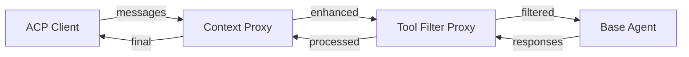
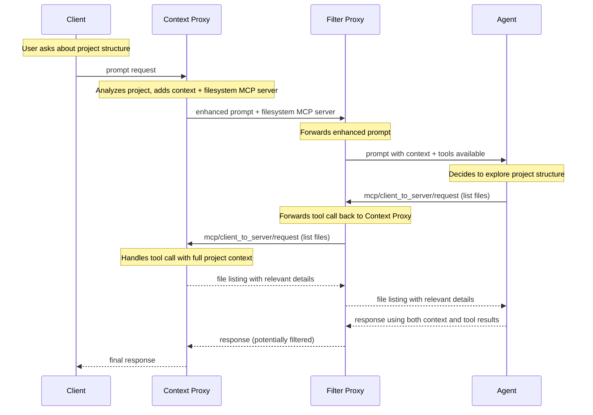
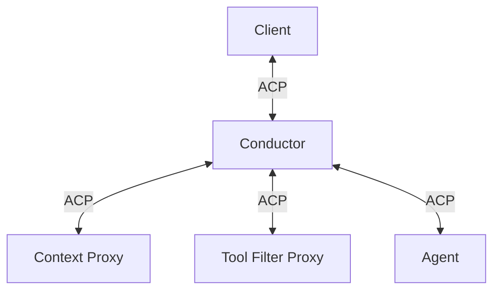
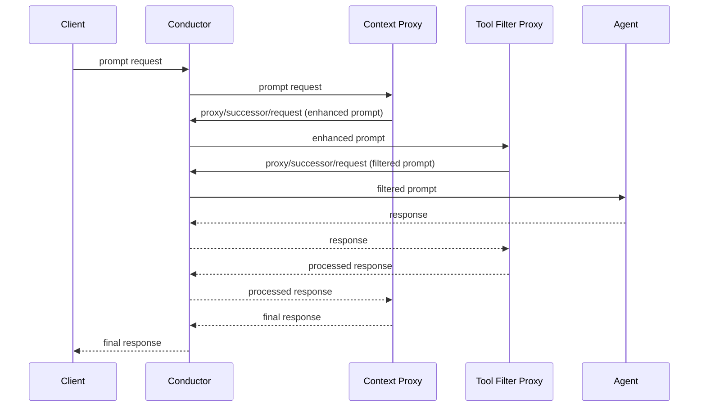
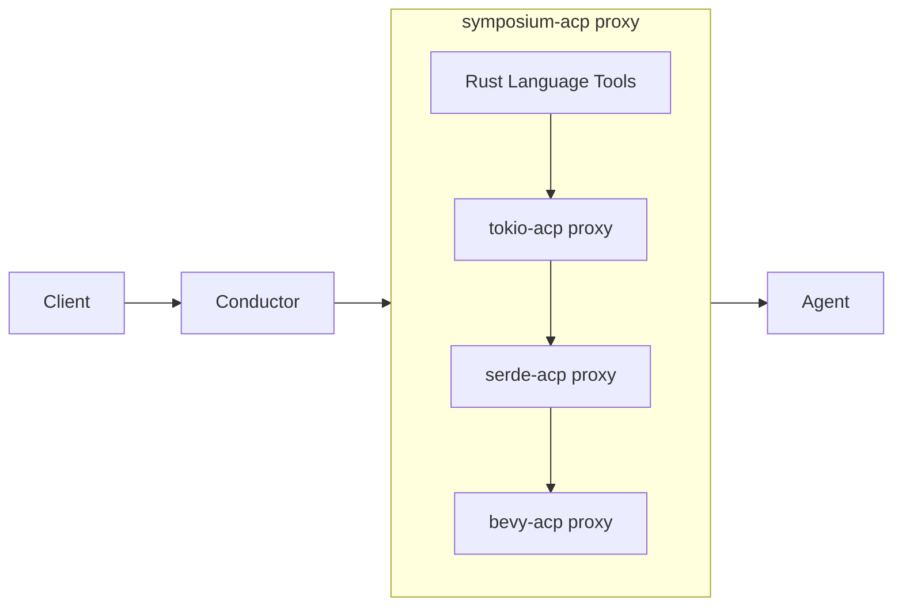
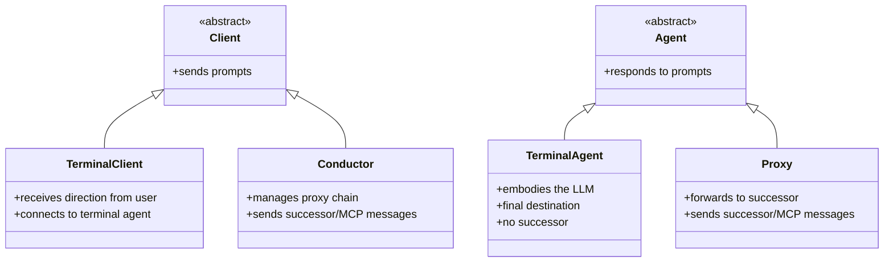
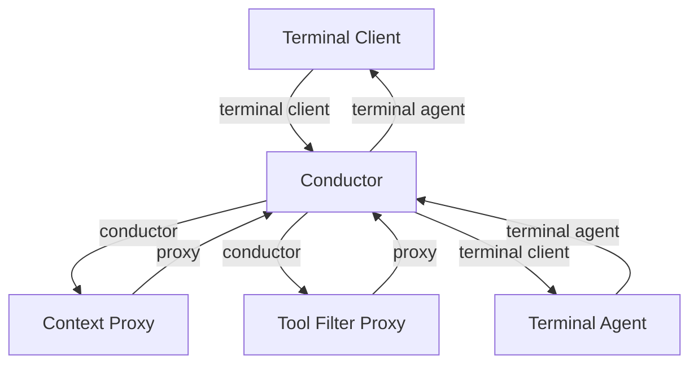
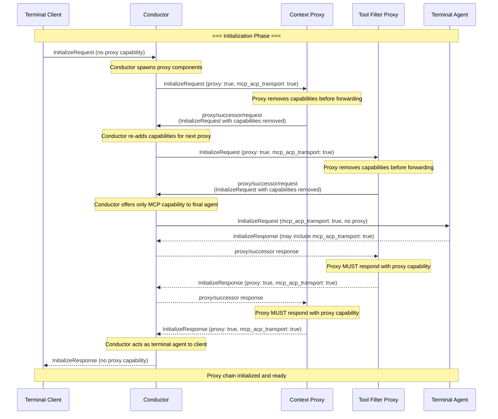
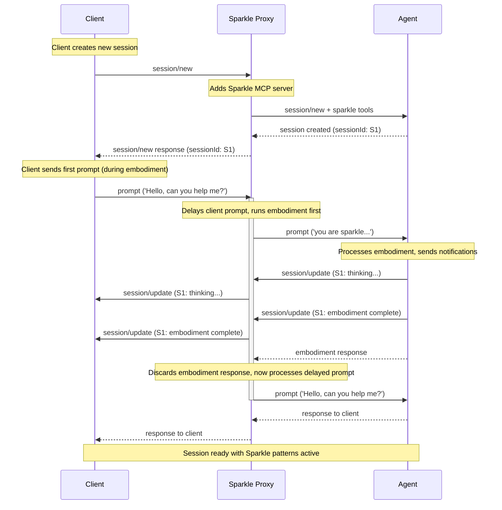

Author(s): [nikomatsakis](https://github.com/nikomatsakis)

## Elevator pitch

> What are you proposing to change?

Add proxy chain capabilities to ACP that allow components to intercept and transform messages between clients and agents, enabling composable agent architectures where techniques like context injection, tool coordination, and response filtering can be extracted into reusable components.

## Status quo

> How do things work today and what problems does this cause? Why would we change things?

The AI agent ecosystem has developed a wide variety of extension mechanisms: AGENTS.md files, Claude Code plugins and skills, rules and steering files, hooks, MCP servers, etc. Of these, only MCP servers and AGENTS.md files have achieved any standardization across the ecosystem.

The popularity of MCP servers demonstrates a clear desire for portable extensions that work across different clients and agents. Many MCP servers come with instructions like "add this text to your context to help the agent use the MCP server correctly," showing that developers want their tools to work seamlessly without manual configuration.

However, MCP servers are fundamentally limited because they sit "behind" the agent. They can provide tools and respond to function calls, but they cannot:

- **Inject or modify prompts** before they reach the agent
- **Add global context** that persists across conversations  
- **Transform responses** before they reach the user
- **Respond to async events** outside the request-response cycle
- **Coordinate between multiple agents** or manage conversation flow

This creates a gap in the ecosystem. Developers want portable, composable extensions, but the only standardized mechanism (MCP) can't handle many common use cases. As a result, valuable techniques like context management, conversation orchestration, and response processing remain locked within individual agent implementations.

Users end up choosing agents not just based on model quality, but on which specific extensions and capabilities are built in. There's no way to take the context injection from one system, the tool coordination from another, and the response filtering from a third, and combine them with your preferred base model.

## What we propose to do about it

> What are you proposing to improve the situation?

We propose extending ACP to enable creating *proxies*, ACP components that sit between the client and the agent. Because proxies can do anything a client could do, they serve as a kind of "universal extension mechanism" that can subsume AGENTS.md, hooks, MCP servers, etc.

Part of the proxy protocol includes the ability to send and receive MCP messages, enabling a single component to (1) add an MCP server to a session and then (2) handle those MCP tool requests. This effectively creates a way for agents to "callback" to a proxy, enabling rich bidirectional interactions beyond simple message transformation.

Proxies are limited to the customizations exposed by ACP itself, so they would benefit from future ACP extensions like mechanisms to customize system prompts. However, they can already handle the majority of common extension use cases through message interception and transformation.

### Proxying in theory

Conceptually, proxies work like a chain where messages flow through each component:



(As described in the "Proxying in Practice" section, proxies in our design do not actually communicate directly with their successor, but instead use a central conductor. For the purposes of explaining the protocol, however, this section will continue to show diagrams "as if" proxies were in direct communication with each other.)

### Proxying MCP requests through ACP

When proxing a `session/new` request, proxies can add MCP servers using a new transport type, `"acp"`. When agents invoke an MCP server that uses `"acp"` transport, the MCP requests are sent through the ACP channel. (To accommodate existing agents, our conductor will automatically bridge MCP servers using `"acp"` transport to use `"stdio"` transport.)

Leveraging `"acp"` transport allows a single ACP proxy to do all of the following:
1. **Add context** by analyzing the project and injecting relevant documentation
2. **Provide tools** via MCP server that understand the injected context
3. **Handle callbacks** when the agent uses those tools, with full awareness of the conversation state

**Example Flow (Idealized)**: Context Proxy (with MCP server) → Filter Proxy → Agent



This demonstrates how proxy chains enable rich, context-aware tooling that would be difficult to achieve with traditional MCP servers alone.

### Proxing in practice: the role of the conductor

To allow for proxy isolation, our design does not have proxies communicate directly with their successor in the chain. Instead, there is a central conductor component that handles routing messages between components.



We add two new ACP methods for proxy communication, **`proxy/successor/request`** and **`proxy/successor/notification`**:
- When sent **from proxy to conductor**: "please send this message to my successor"
- When sent **from conductor to proxy**: "this message arrived from your successor"

Here's how a single message flows through the system:



## Shiny future

> How will things will play out once this feature exists?

### User Experience and Editor Integration

We expect editors to expose the ability to install proxies in the same way they currently support adding MCP servers - in fact, the distinction probably doesn't matter to users. Both are "extensions" that add capabilities to their AI workflow.

When proxies are installed, editors would not start the agent directly, but instead invoke the conductor with the configured proxy chain. From the user's perspective, they're just getting enhanced agent capabilities - the proxy chain architecture remains transparent.

### Language-Specific Proxy Ecosystems

The monolithic nature of agent development has meant that most of the "action" happens within agents. We wish to invert this, with agents trending towards simple agentic loops, and the creativity being pushed outwards into the broader ecosystem.

The Symposium project is one example exploring this concept, with a focus on Rust. The idea is to give Rust users an automatic set of extensions based on the dependencies they are using. These extensions would be packaged up as SACP proxies using WebAssembly for portability and sandboxing.

Symposium aims to become the standard "Rust ACP experience" by providing both core Rust tooling and a framework for Rust libraries to contribute their own proxy components.



## Implementation details and plan

> Tell me more about your implementation. What is your detailed implementation plan?

### Component Roles

ACP defines client and agent as superroles, each with two specializations:



**Terminal roles**: Standard ACP behavior - direct client-to-agent communication.

**Non-terminal roles**: Extended ACP behavior - clients manage proxy chains, agents forward to successors.

**Example Architecture:**



### Capability Reference

**Proxy Capability** (`"proxy": true`)
- When offered by a client, indicates that the ACP server is to act as a proxy, not a final agent. It should expect to send/receive requests to its successor.
- It is only legal to include in a server's initialization response if it was offered by the client. In that case, it indicates that the server agrees to act as a proxy, not as an agent.
- When a component responds with proxy capability, it SHOULD forward requests it does not understand and it SHOULD preserve metadata fields when forwarding messages.

**MCP-over-ACP Transport** (`"mcp_acp_transport": true`)
- Indicates a component can handle MCP messages with `"transport": "acp"`
- Must handle `mcp/client_to_server/request` and `mcp/server_to_client/request` messages
- Enables seamless MCP server provision and tool callbacks

### Proxy initialization Protocol

When an ACP server is started, it is sent an `InitializeRequest`:

- **Terminal client ↔ terminal agent initialization**: `InitializeRequest` does not have proxy or has `"proxy": false`. The server MUST act as a terminal agent. The server MUST NOT respond with `"proxy": true` in the `InitializeResponse` - doing so is an error.

- **Conductor ↔ proxy initialization**: `InitializeRequest` contains `"proxy": true`. The server MUST respond with `"proxy": true` in the `InitializeResponse` to acknowledge it will act as a proxy. The conductor MUST error and terminate if the server responds without `"proxy": true`.

- **Proxy ↔ successor agent**: When a proxy receives an `InitializeRequest`, it MUST remove the `"proxy"` capability before forwarding via `proxy/successor/request`.

Note: The conductor executable plays different roles depending on how it is used - it acts as a terminal agent when initialized by a terminal client, but as a proxy when initialized by another conductor (enabling nested proxy chains).

### MCP Transport Capability Initialization

MCP transport capability negotiation follows different rules depending on the relationship:

- **Conductor ↔ proxy initialization**: The conductor MUST offer `"mcp_acp_transport": true` in the `InitializeRequest`. The proxy MUST respond with `"mcp_acp_transport": true` in the `InitializeResponse` - all proxies are required to tolerate MCP servers that use ACP transport.

- **Terminal client ↔ terminal agent initialization**: The client MAY offer `"mcp_acp_transport": true` in the `InitializeRequest`. The agent MAY respond with `"mcp_acp_transport": true` in the `InitializeResponse` if it supports native MCP-over-ACP transport.

- **Proxy ↔ successor agent**: When a proxy receives an `InitializeRequest`, it MUST remove the `"mcp_acp_transport"` capability before forwarding via `proxy/successor/request`.

Note: Because a conductor MUST offer `"mcp_acp_transport"` to each proxy but terminal agents are not obligated to support `"mcp_acp_transport"`, this implies that a conductor MUST be able to offer a bridge between alternative MCP transport methods and ACP transport.

### Message Reference

**Proxy Messages:**
```json
// Proxy sends message to successor
{"method": "proxy/successor/request", "params": {"message": <ACP_REQUEST>}}
{"method": "proxy/successor/notification", "params": {"message": <ACP_NOTIFICATION>}}

// Conductor delivers message from successor  
{"method": "proxy/successor/receive/request", "params": {"message": <ACP_REQUEST>}}
{"method": "proxy/successor/receive/notification", "params": {"message": <ACP_NOTIFICATION>}}
```

**MCP Messages:**
```json
// Agent calls MCP tool (flows backward to proxy)
{"method": "mcp/client_to_server/request", "params": {"uuid": "...", "message": <MCP_REQUEST>}}

// MCP server callback (flows forward to agent)  
{"method": "mcp/server_to_client/request", "params": {"uuid": "...", "message": <MCP_REQUEST>}}
```

The `uuid` parameter identifies which proxy component owns the MCP server - the conductor routes MCP messages to the component that declared the matching UUID in its MCP server specification.

### MCP Transport Extension

We extend the MCP JSON schema to support ACP as a new transport type alongside existing stdio and HTTP transports.

**Extended MCP Server Schema:**
```json
{
  "type": "object",
  "properties": {
    "transport": {
      "type": "string",
      "enum": ["stdio", "http", "acp"]
    }
  },
  "allOf": [
    {
      "if": {
        "properties": { "transport": { "const": "stdio" } }
      },
      "then": {
        "properties": {
          "command": { "type": "string" },
          "args": { "type": "array", "items": { "type": "string" } }
        },
        "required": ["command"]
      }
    },
    {
      "if": {
        "properties": { "transport": { "const": "http" } }
      },
      "then": {
        "properties": {
          "url": { "type": "string" },
          "headers": { "type": "object" }
        },
        "required": ["url"]
      }
    },
    {
      "if": {
        "properties": { "transport": { "const": "acp" } }
      },
      "then": {
        "properties": {
          "uuid": { 
            "type": "string",
            "pattern": "^[0-9a-f]{8}-[0-9a-f]{4}-[0-9a-f]{4}-[0-9a-f]{4}-[0-9a-f]{12}$"
          }
        },
        "required": ["uuid"]
      }
    }
  ]
}
```

**Example ACP Transport Declaration:**
```json
{
  "tools": {
    "mcpServers": {
      "filesystem": {
        "transport": "acp",
        "uuid": "550e8400-e29b-41d4-a716-446655440000"
      }
    }
  }
}
```

### Examples (Non-normative)

The following sequence diagrams illustrate common proxy chain scenarios for implementers.

#### Initialization of a 4-Component Proxy Chain

This shows the initialization flow for: Terminal Client → Conductor → Context Proxy → Tool Filter Proxy → Terminal Agent



#### Context-Providing MCP Server with Session Notifications

This example shows how a proxy can handle initialization and forward session notifications. Sparkle (a collaborative AI framework) runs an embodiment sequence during session creation.



This demonstrates how proxies can run initialization sequences during session creation while transparently forwarding all session notifications back to the client.

## Frequently asked questions

> What questions have arisen over the course of authoring this document or during subsequent discussions?

### Why do proxies remove the proxy/MCP capabilities when forwarding to their successor?

The conductor would always re-add these capabilities anyway, which shows that they are really specific to conductor↔proxy communication and so we decided to simply omit them. This makes it clear that these capabilities are part of the conductor's orchestration protocol rather than something proxies need to understand or manage.

### How do proxies subsume existing agent extension mechanisms?

Because proxies sit between the client and agent, they can replicate the functionality of existing extension mechanisms:

- **AGENTS.md files**: Proxies can inject context and instructions into prompts before they reach the agent
- **Claude Code plugins/skills**: Proxies can add contextual data for available skills and provide MCP resources with detailed skill instructions that are provided on-demand when requested by the agent
- **MCP servers**: Proxies can provide tools via the MCP-over-ACP protocol and handle tool callbacks
- **Subagents**: Proxies can create "subagents" by initiating new sessions and coordinating between multiple agent instances
- **Hooks and steering files**: Proxies can modify conversation flow by intercepting requests and responses
- **System prompt customization**: Proxies can switch between predefined session modes or prepend system messages to prompts

The key advantage is that proxy-based extensions work with any ACP-compatible agent without requiring agent-specific integration or modification.

### Are there any limitations to what proxies can do?

Yes, proxies are limited to what is available through the ACP protocol itself. They can intercept and transform any ACP message, but they cannot access capabilities that ACP doesn't expose.

For example, proxies cannot directly modify an agent's system prompt or context window - they can only switch between predefined session modes (which may affect system prompts) or prepend additional messages to prompts. Similarly, proxies cannot access internal agent state, model parameters, or other implementation details that aren't exposed through ACP messages.

This is actually a feature - it ensures that proxy-based extensions remain portable across different agent implementations and don't rely on agent-specific internals.

### How does the standard conductor implementation work?

The `sacp-conductor` reference implementation can form trees of proxy chains. When offered the proxy capability, it expects to be given a list of components that are all proxies. When the last proxy in its managed chain sends a message to its successor, the conductor forwards that message to its own parent conductor.

This enables hierarchical structures like:
```
client → conductor1 → final-agent
             ↓ manages
         proxy-a → conductor2 → proxy-d
                      ↓ manages  
                  proxy-b → proxy-c
```

The conductor handles process management, capability negotiation, and message routing, but these are implementation details - the protocol only specifies the message formats and capability requirements.

### What's the current implementation status?

A prototype version of this proposal has been implemented and is available on crates.io as the crates

* `sacp` -- base ACP protocol SDK
  * `sacp-tokio` -- adds specific utilities for use with the `tokio` runtime
* `sacp-proxy` -- extensions for implementing a proxy
  * `sacp-rmcp` -- adds specific proxy extension traits for bridging to the rmcp crate
* sacp-conductor -- reference conductor implementation

The canonical sources for those crates is currently the [symposium-dev/symposium-acp] repository. However, copies have been upstreamed to the [agentclientprotocol/rust-sdk](https://github.com/agentclientprotocol/rust-sdk/tree/main/src/sacp-conductor) repository and, if and when this RFD is accepted, that will become the canonical home.

### Why not just cascade ACP commands without protocol changes?

One alternative is to make proxies be ordinary agents that internally create and manage their successors. This works (HTTP proxies operate this way) but requires each proxy to understand the full chain and know how to start its successors.

This couples proxies to transport mechanisms, process management, and chain configuration. Changing transports, reordering the chain, or inserting a new proxy requires modifying predecessor configurations.

The conductor design decouples proxies from their successors. Proxies send messages "to successor" and receive messages "from successor" without knowing who that successor is, how it's started, or what transport it uses. This enables:

- Changing transport protocols or process management without recompiling proxies
- Shipping proxies as low-capability WASM containers that need only a single communication channel
- Reordering, adding, or removing proxies through configuration rather than code changes

The tradeoff is protocol complexity, but this complexity lives in the conductor (implemented once) rather than being duplicated across proxy implementations.

### Why do all messages go through the conductor instead of direct proxy-to-proxy communication?

Even with a conductor, proxies could communicate directly with their successors after the conductor sets up connections. Routing all messages through the conductor further minimizes proxy responsibilities to a single communication channel.

This supports running proxies as isolated WebAssembly components with minimal capabilities. It also removes redundant logic: without the conductor routing messages, each proxy would need to manage connections to its successor.

The conductor handles process management, capability negotiation, and message routing, allowing proxies to focus on transformation logic.

### What about security concerns with proxy chains?

Proxy components can intercept and modify all communication, so trust is essential - similar to installing any software. Users are responsible for the components they choose to run.

We plan to explore WebAssembly-based proxies which will offer some measure of sandboxing but such components could still modify prompts in unknown or malicious ways.

### What about performance implications of the proxy chain?

Our architecture does introduce additional message passing - each proxy in the chain adds extra hops as messages flow through the conductor. However, these messages are typically small and inexpensive, particularly when compared to the latency of actual LLM inference.

For messages that contain significant quantities of data (large file contents, extensive context), we may wish to have the conductor store that data centrally and introduce a "reference" mechanism so that most proxies don't have to inspect or copy large payloads unless they specifically need to transform them.

The benefits of composability typically outweigh the minimal latency costs for human-paced development interactions.

### What happens when proxy components crash or misbehave?

The conductor manages component lifecycles:
- Failed components are restarted automatically where possible
- Component crashes don't affect the rest of the chain
- Graceful degradation by bypassing failed components
- Clear error reporting to help users debug configuration issues

### Can proxy chains be nested or form trees?

Yes! The conductor can itself run in proxy mode, enabling hierarchical structures:

```
client → proxy1 → conductor (proxy mode) → final-agent
                      ↓ manages  
                  p1 → p2 → p3
```

This enables complex compositions while maintaining clean interfaces.

## Revision history

Initial draft based on working implementation in symposium-acp repository.
