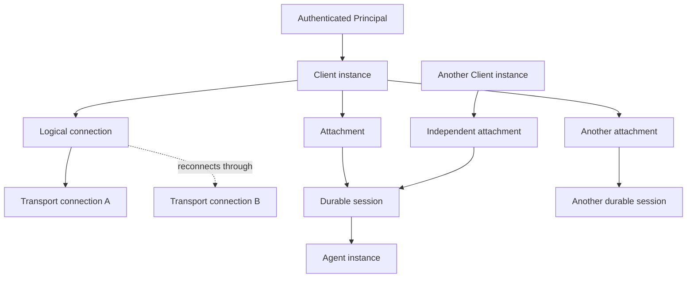

Author(s): ACP Remote working draft

<Warning>
  This is a design draft, not a stable protocol commitment. Names introduced in
  this RFD, including method, capability, header, field, and error names, are
  **provisional** until their schema RFDs are accepted.
</Warning>

## Elevator pitch

> What are you proposing to change?

Make remote operation a first-class ACP profile rather than treating HTTP or
WebSocket as a byte-stream substitute for stdio.

ACP Remote will define:

- authenticated principals and authorization boundaries;
- durable sessions that are independent of transport connections;
- explicit client attachments to sessions;
- ordered, resumable delivery with bounded retention and snapshot recovery;
- retry-safe client operations;
- multi-client attribution, arbitration, steering, and user-input routing; and
- a host layer for remote workspaces and agent lifecycle where deployments need
  it.

The work should be completed in the experimental ACP v2 design unless v2 is
stabilized before these foundations land. Creating v3 now would preserve known
remote ambiguities in v2 without protecting a stable compatibility contract.

## Status quo

> How do things work today and what problems does this cause? Why would we change things?

ACP's documented architecture is primarily local and trusted. A Client launches
an Agent subprocess, communicates over stdin and stdout, and may give the Agent
access to local files and MCP servers. One connection can carry several
sessions, but the connection still has one Client peer. See
[Architecture](/get-started/architecture) and
[Transports](/protocol/v2/transports).

ACP v2 improves several foundations:

- `session/resume` can restore a session and optionally replay its conversation
  from the start;
- `session/prompt` acknowledges acceptance instead of remaining open for an
  entire turn;
- session state updates can continue outside a prompt request;
- messages and other session entities have stable IDs within a session; and
- JSON-RPC batches follow the JSON-RPC 2.0 processing model.

These changes make remote ACP easier to add, but they do not yet define remote
correctness. In particular:

### Delivery and reconnection are incomplete

`session/update` has a session ID and update payload, but no delivery sequence,
replay cursor, session revision, or producer identity. Message IDs identify
message entities; they are not delivery IDs and are not required to remain
stable across a v1 session load. See the [Message ID RFD](../message-id).

The current v2 replay shape supports only replay from the beginning of a
conversation. Replay notifications arrive before the `session/resume` response,
but there is no snapshot cursor or atomic boundary between replay and live
updates. See [v2 Session Resume Replay](../v2/session-resume-replay).

The active [Streamable HTTP and WebSocket Transport
RFD](../streamable-http-websocket-transport) explicitly defers message
sequencing, replay, reconnect, and keepalive. Some of its examples also use v1
methods and response shapes that no longer exist in v2. Its per-session streams
cannot provide one authoritative order across connection-level responses and
session updates.

### Retrying a mutation can duplicate it

A Client can lose the connection after an Agent accepted a prompt, config
change, permission response, or cancellation but before the Client observed the
result. Existing requests contain JSON-RPC correlation IDs, but no durable
idempotency identity. Reusing a JSON-RPC ID on a new connection does not prove
that a retry represents the same operation.

Network transports already provide ordered bytes while a connection remains
healthy. The missing guarantee is recovery at a disconnect boundary: the Client
must be able to distinguish "not received", "accepted but response lost", and
"completed and already observed".

### Sessions and connections are conflated

The existing remote transport draft stores sessions under one connection and
terminates associated sessions when that connection is deleted. At the same
time, it says sessions survive disconnects. Neither rule works for a durable
session shared by several Clients.

Current session lifecycle methods also have single-peer effects:

- `session/close` cancels work and frees the whole active session;
- `session/cancel` stops all foreground work for the session;
- `session/set_config_option` has no expected revision; and
- `session/resume` can replace workspace-directory and MCP-server inputs.

ACP does not distinguish closing one Client's view from terminating a shared
session, or cancelling one operation from cancelling another Client's work.

### Multi-client decisions have no owner

Permissions and elicitations are bidirectional JSON-RPC requests sent to one
Client connection. The [Elicitation documentation](/protocol/v2/elicitation)
requires an Agent to bind elicitation state to the receiving connection and,
when available, a verified user identity. ACP does not yet define that remote
identity or what happens if the Client disconnects.

Broadcasting one request to several Clients would introduce competing responses
without a claim, first-writer, quorum, or authorization rule. Sending it to one
Client would strand the Agent when that Client disappears.

### Existing authentication is not endpoint access control

ACP `authMethods`, `auth/login`, and `auth/logout` describe authentication state
managed by the Agent. They do not define how an HTTP or WebSocket endpoint
authenticates a caller before initialization, binds a verified principal to a
connection, authorizes access to a session, or isolates tenants. Terminal login
also assumes the Client can launch the Agent program and therefore does not
generally apply to remote Clients. See
[Authentication](/protocol/v2/authentication).

### A remote path has no declared filesystem authority

ACP paths are absolute, but an absolute path sent over a network is ambiguous
unless the protocol says which machine or workspace owns its namespace. V2 also
removes Client filesystem and terminal execution methods, recommending MCP for
specialized Client-provided tools. See [Client Filesystem and Terminal
Capabilities](../v2/client-filesystem-terminal-capabilities).

MCP can expose tools, but it does not by itself define workspace provisioning,
repository checkout, file synchronization, upload and download, durable
artifacts, or host lifecycle.

### The Rust runtime is maintained separately

This repository contains protocol types, generated schemas, and documentation.
The higher-level Rust runtime is maintained in
[`agentclientprotocol/rust-sdk`](https://github.com/agentclientprotocol/rust-sdk).
Schema work belongs here; transport supervision, reconnect state, and concrete
HTTP/WebSocket implementations normally belong in that SDK unless the project
deliberately changes the repository boundary.

## What we propose to do about it

> What are you proposing to improve the situation?

### Negotiate one wire profile and an explicit capability graph

Remote correctness is more than transport framing. A Client and Agent claiming
the ACP Remote profile **MUST** select the single provisional wire-profile token
`acp.remote.v2`. Implementations **MUST NOT** mint transport-specific or
feature-specific wire profiles for HTTP, WebSocket, shared sessions, or Host
services.

The provisional capability graph is:

```json
{
  "capabilities": {
    "remote": {
      "core": {},
      "sharedSessions": {},
      "hostServices": {}
    }
  }
}
```

- `capabilities.remote.core` is mandatory for `acp.remote.v2`. It covers
  authenticated logical connections, ordered delivery, acknowledgements,
  replay, atomic recovery, operation deduplication, liveness, and
  backpressure.
- `capabilities.remote.sharedSessions` depends on `capabilities.remote.core`. It adds
  connection-independent attachments, multiple authorized participants,
  canonical Session events, and collaboration semantics.
- `capabilities.remote.hostServices` depends on `capabilities.remote.core`. It adds hosted
  Agent discovery and lifecycle plus advertised resource, workspace, artifact,
  and other Host service families. It does not implicitly advertise
  `sharedSessions`.

The exact field names remain provisional, but this dependency graph is
normative. Following the existing v2 support-marker rule, omission or `null`
for either optional child means unsupported; `core` is required and non-null
whenever `acp.remote.v2` is selected. Advertising either child without `core`
is invalid. If a Client
requests a capability label that the server cannot satisfy, initialization
**MUST** fail with an explicit `unsupported_capability` result. The server
**MUST NOT** silently downgrade to core, framing-only HTTP, or a weaker private
profile. A Client may retry only by explicitly offering a smaller capability
set.

Conformance labels map to the capability graph, but the full Host label has a
stronger test-coverage requirement than the wire dependency itself:

| Conformance label      | Required negotiated capabilities and coverage                                                                                                                        |
| ---------------------- | -------------------------------------------------------------------------------------------------------------------------------------------------------------------- |
| `acp.remote.v2.core`   | `capabilities.remote.core`                                                                                                                                           |
| `acp.remote.v2.shared` | `capabilities.remote.core` and `capabilities.remote.sharedSessions`                                                                                                  |
| `acp.remote.v2.host`   | Core, `capabilities.remote.sharedSessions`, `capabilities.remote.hostServices`, and every service/extensibility/operational group required by the full parity ledger |

These strings are report and test-selection labels, not additional negotiated
wire profiles. `capabilities.remote.hostServices` still depends only on Core at
the wire level and does not imply `sharedSessions`. A partial Host-services
deployment reports Core plus each individual service capability it passes; it
**MUST NOT** claim `acp.remote.v2.host`. Passing a higher label does not excuse
failure of the Core suite.

Transport authentication **MUST** occur before any session information is
exposed. Protocol initialization then negotiates ACP version and capabilities
and binds the resulting logical connection to the verified principal.

### Use a precise state model

The following terms are normative concepts. Their exact wire type names remain
provisional.

| Term                     | Meaning                                                                                                                                                                                   |
| ------------------------ | ----------------------------------------------------------------------------------------------------------------------------------------------------------------------------------------- |
| **Host**                 | A service that exposes one or more Agent implementations or instances. A local executable can combine Host and Agent roles.                                                               |
| **Agent implementation** | A named ACP-capable program or service with declared behavior and capabilities.                                                                                                           |
| **Agent instance**       | A running or resumable execution context selected or created by a Host. One instance may serve one or more sessions if its implementation permits it.                                     |
| **Principal**            | The security subject verified by the transport authentication layer, such as a user, service account, or workload identity. A claimed Client ID is not a Principal.                       |
| **Client instance**      | A logical ACP Client installation or process identity that can survive transport reconnection. It is bound to a Principal but does not grant authority by itself.                         |
| **Transport connection** | One physical HTTP stream, WebSocket, stdio pipe pair, or equivalent byte/message channel. It is disposable and may be replaced.                                                           |
| **Logical connection**   | Negotiated ACP state that can outlive one transport connection for a bounded resume period. It owns connection-level ordering and pending RPC correlation.                                |
| **Session**              | Durable Agent-owned conversation and workspace state identified by `sessionId`. It is not owned by a transport connection.                                                                |
| **Attachment**           | One Principal and Client instance's authorized subscription to a Session, including role, delivery position, and Client-specific presentation capabilities.                               |
| **Operation**            | A Client-originated action with a stable idempotency identity. One operation may cause Agent work and multiple events.                                                                    |
| **Activity**             | A cancellable unit of Agent work, such as processing an accepted prompt or invoking a tool. Activities have scope independent of JSON-RPC transport requests.                             |
| **Canonical event**      | A server-authoritative Session or resource-state mutation with a durable domain event ID and revision. The same event keeps those identities when fanned out to several Clients.          |
| **Delivery record**      | One connection-specific envelope containing JSON-RPC, a canonical Event, an operation receipt, or recovery control. Every server-to-Client record after initialize has a delivery cursor. |
| **Delivery cursor**      | An opaque checkpoint in one logical connection's delivery order. The same canonical Event has a different delivery cursor on each logical connection.                                     |
| **SnapshotSet**          | One authorized, atomic replacement of every active Attachment and resource view on a logical connection, bound to one server epoch and delivery high-water mark.                          |
| **Server epoch**         | The identity of the ordering authority that issued a Cursor. A restart or failover that cannot preserve ordering creates a new epoch.                                                     |

The ownership relationships are:



Implementations of the remote profile **MUST** preserve these invariants:

1. A Session **MUST NOT** be destroyed merely because a Transport connection
   closes.
2. A Session **MAY** have several Attachments belonging to different authorized
   Principals or Client instances.
3. A successful reconnect **MUST** fence the superseded Transport connection so
   that two physical connections cannot both act as the same logical connection
   generation.
4. Transport and Session identifiers **MUST NOT** be treated as credentials.
5. Client capabilities negotiated for one Attachment **MUST NOT** silently
   replace another Attachment's capabilities or canonical Session state.
6. Detaching one Client **MUST NOT** terminate a shared Session. Detach and
   terminate **MUST** be distinct operations.
7. Every Session mutation **MUST** be authorized against the authenticated
   Principal and current Session policy.
8. Every post-initialize server record **MUST** be wrapped in the logical
   connection's delivery order.
9. Canonical Session and resource Events **MUST** retain their domain event IDs
   and revisions across fan-out, replay, and SnapshotSet recovery.

### Keep three recovery layers distinct

ACP Remote has three related but non-interchangeable layers:

1. **Connection delivery.** One delivery cursor wraps every post-initialize
   server record, including responses, reverse requests, notifications,
   canonical Events, operation receipts, and recovery controls. Delivery replay
   repairs one logical connection.
2. **Canonical domain state.** Session and resource mutations have durable
   domain event IDs and decimal-string revisions. The same canonical Event can
   appear in several Clients' delivery streams under different delivery
   cursors. Domain revisions, not connection delivery order, arbitrate shared
   state.
3. **Atomic recovery state.** A `SnapshotSet` contains one `snapshotId`, the
   `serverEpoch`, one `throughDeliveryCursor`, and every active authorized
   Attachment and resource view. The Client adopts the whole set atomically,
   receives the tail after its high-water mark, then crosses a `caught_up`
   barrier.

Session-history replay reconstructs durable Session state, potentially months
later and from a different Client. It can omit explicitly ephemeral
presentation events.

The protocol **MUST NOT** use `messageId`, `toolCallId`, or another entity ID as
a delivery cursor or canonical Event ID. The [Reliable Remote
Transport](./reliable-transport) RFD defines the delivery layer and SnapshotSet
cutover; a session attachment RFD will define canonical Session event payloads
and view contents.

### Make mutations retry-safe

Every remote Client operation **MUST** carry one canonical `operationId` that
the Client reuses on retry. Initialization, resume, ordinary requests,
notifications, reverse-request responses, and batch entries use the same
operation ledger and the same operation-receipt shape. There is no separate
bootstrap, submission, notification, or response idempotency namespace.

Servers **MUST** deduplicate within an advertised window, **MUST** return the
stored receipt for a retry, and **MUST** reject reuse of one `operationId` with
a different logical payload.

JSON-RPC request IDs remain response-correlation IDs. They **MUST NOT** be used
as a substitute for an operation identity across logical connections.

Operations that update versioned shared state **SHOULD** support an expected
revision. A stale write **MUST** produce a typed conflict rather than silently
overwriting another Client's update.

Agent-to-Client requests additionally receive a durable `reverseRequestId`.
Permissions, elicitations, and other durable interactions also carry a domain
`interactionId`. A Client response **MUST** bind its `operationId` to the
expected reverse-request or interaction identity before the receiver ignores
the JSON-RPC ID of that particular delivery attempt.

### Define collaboration above reliable delivery

Reliable fan-out alone does not decide who may act. Companion RFDs will define:

- participant identity and event provenance;
- owner, controller, editor, and viewer-style roles or equivalent permissions;
- prompt insertion, steering, and queue policy;
- activity-scoped cancellation;
- attachment leases and presence;
- permission and elicitation assignment, claim, expiry, and conflict behavior;
- shared versus per-Principal state; and
- audit information for security-sensitive actions.

An Agent **MUST NOT** interpret "first packet wins" as an authorization or
collaboration policy.

### Common provisional remote error registry

All ACP Remote RFDs use this one provisional condition registry. Final JSON-RPC
numeric codes and Rust variant names require registry review; companion RFDs
**MUST NOT** invent aliases for the same condition.

| Provisional condition       | Meaning                                                                                     | Retry guidance                                              |
| --------------------------- | ------------------------------------------------------------------------------------------- | ----------------------------------------------------------- |
| `unauthenticated`           | Endpoint credentials are absent, invalid, or expired                                        | Reauthenticate before retry                                 |
| `forbidden`                 | The Principal lacks authority for the endpoint, operation, Session, Attachment, or resource | Do not retry unchanged                                      |
| `unsupported_profile`       | `acp.remote.v2` is unavailable                                                              | Negotiate a supported protocol explicitly                   |
| `unsupported_capability`    | A requested core, shared, or Host capability or dependency cannot be satisfied              | Retry only with an explicitly smaller capability request    |
| `invalid_resume`            | The logical connection, Client binding, or resume secret is invalid or expired              | Establish a new logical connection or reauthenticate        |
| `connection_fenced`         | A newer physical-connection generation superseded this one                                  | Stop using the old generation                               |
| `connection_not_live`       | A non-allowlisted operation arrived before the initial or recovery `caught_up` barrier      | Complete recovery before retry                              |
| `cursor_gap`                | Exact delivery replay from the requested cursor is unavailable                              | Atomically adopt a SnapshotSet                              |
| `server_epoch_changed`      | The ordering authority changed without preserving cursor continuity                         | Atomically adopt a SnapshotSet                              |
| `snapshot_incomplete`       | A SnapshotSet cannot represent every active Attachment and resource view                    | Do not claim synchronization; retry or detach explicitly    |
| `snapshot_conflict`         | Snapshot authorization or active-view membership changed before adoption                    | Request a fresh authorized SnapshotSet                      |
| `operation_conflict`        | One `operationId` was reused with different logical input                                   | Client bug; do not retry unchanged                          |
| `operation_outcome_unknown` | The operation ledger expired before the outcome could be proven                             | Query canonical domain state or ask the user                |
| `reverse_request_mismatch`  | A response does not bind to the expected `reverseRequestId` or `interactionId`              | Refresh pending interactions; do not guess from JSON-RPC ID |
| `revision_conflict`         | An expected Session, resource, interaction, or attachment revision/fence is stale           | Refresh canonical state and retry deliberately              |
| `backpressure`              | Unacknowledged delivery or queued work exceeded a negotiated limit                          | Drain, acknowledge, and retry after guidance                |
| `rate_limited`              | Principal or tenant rate policy rejected otherwise valid work                               | Retry after advertised guidance                             |
| `message_too_large`         | A frame exceeds a negotiated limit                                                          | Reduce or externalize content                               |
| `temporarily_unavailable`   | The Host cannot currently serve an otherwise valid operation                                | Retry according to advertised guidance                      |

Structured error data **SHOULD** include the provisional `condition`, a
`retryable` boolean, and relevant IDs or recovery information. Optional members
are non-nullable: omission means the datum is unavailable, while explicit
`null` is invalid. Durations, counters, revisions, and fencing values in error
data **MUST** be decimal strings.

### RFD dependency map

The following names and file split are provisional, but the dependency order is
intentional:

| Order | RFD                                                   | Depends on                                      | Enables                                                        |
| ----- | ----------------------------------------------------- | ----------------------------------------------- | -------------------------------------------------------------- |
| 0     | **ACP Remote Overview** (this RFD)                    | ACP v2 direction                                | Shared terminology and scope                                   |
| 1     | **Remote Endpoint Authentication and Authorization**  | Overview                                        | Verified Principal, session ACL checks, tenant isolation       |
| 1     | **Reliable Remote Transport**                         | Overview                                        | Ordered delivery, reconnect, replay, idempotent submissions    |
| 2     | **Session Attachments, Snapshots, and Event History** | Authentication, reliable transport              | Multi-client fan-out and atomic replay-to-live recovery        |
| 3     | **Reliable Mutations and Shared-State Revisions**     | Attachments                                     | Conflict-safe configuration and retryable operations           |
| 3     | **Collaboration, Steering, and Activity Lifecycle**   | Attachments, reliable mutations                 | Prompt queues, attribution, scoped cancellation, control roles |
| 3     | **Permission and Elicitation Coordination**           | Authentication, attachments, reliable mutations | Claimable and reconnectable user decisions                     |
| 4     | **Remote Workspaces, Resources, and Artifacts**       | Authentication, reliable transport              | Declared filesystem authority and transferable content         |
| 4     | **Agent Host Discovery and Lifecycle**                | Authentication, workspaces                      | Hosted Agent selection, provisioning, health, and quotas       |
| 5     | **Remote SDK and Conformance Suite**                  | All relevant normative RFDs                     | Interoperable clients, agents, hosts, and fault tests          |

Authentication and reliable transport may be designed in parallel. Session
attachments require both. Collaboration and host features **MUST NOT** invent
their own delivery, retry, or identity rules.

### Relationship to open proposals

This suite incorporates useful work from open ACP proposals while changing the
parts that are unsafe on a remote multi-principal connection:

| Proposal                                                                                                                                                                                                                                                                                                                                                                             | ACP Remote disposition                                                                                                                                                                                                                                                                                                                                                                                              |
| ------------------------------------------------------------------------------------------------------------------------------------------------------------------------------------------------------------------------------------------------------------------------------------------------------------------------------------------------------------------------------------ | ------------------------------------------------------------------------------------------------------------------------------------------------------------------------------------------------------------------------------------------------------------------------------------------------------------------------------------------------------------------------------------------------------------------- |
| [Multi-client session attach #533](https://github.com/agentclientprotocol/agent-client-protocol/pull/533)                                                                                                                                                                                                                                                                            | Keep explicit attach/detach, history choice, participant discovery, and pending-decision recovery. Replace self-asserted authority, equal Client permissions, first-response-wins, unbounded inline history, and message-only cursors with authenticated attachments, ACLs, claims, snapshots, and session-event cursors. Reuse v2 `user_message` and `state_update` instead of adding parallel prompt/turn events. |
| [`session/ready` #419](https://github.com/agentclientprotocol/agent-client-protocol/pull/419)                                                                                                                                                                                                                                                                                        | Use its registration-barrier goal, bound to an authorized attachment and an atomic replay/live boundary. It is not a delivery acknowledgement by itself.                                                                                                                                                                                                                                                            |
| Queue and steering [#1261](https://github.com/agentclientprotocol/agent-client-protocol/pull/1261) and schema [#2043](https://github.com/agentclientprotocol/agent-client-protocol/pull/2043)                                                                                                                                                                                        | Preserve explicit queue/steer/revoke/replace behavior and authoritative `user_message` delivery. Add operation IDs, cross-Client committed ordering, authorization, targeted activity IDs, and conflict outcomes.                                                                                                                                                                                                   |
| [`session/status` #986](https://github.com/agentclientprotocol/agent-client-protocol/pull/986)                                                                                                                                                                                                                                                                                       | Expand the two-state probe into an authorized lifecycle/placement result that can distinguish active, suspended, resumable, closed, evicted, unknown, and temporarily unreachable state and can expose an epoch or recovery hint safely.                                                                                                                                                                            |
| Remote session/workspace [#442](https://github.com/agentclientprotocol/agent-client-protocol/pull/442)                                                                                                                                                                                                                                                                               | Treat Git URL, revision, and result branch as one workspace/artifact provider profile, not as transport, identity, or reconnect semantics.                                                                                                                                                                                                                                                                          |
| Logging [#392](https://github.com/agentclientprotocol/agent-client-protocol/pull/392)                                                                                                                                                                                                                                                                                                | Structured logs help diagnose recovery, but are neither durable events nor authorization audit records.                                                                                                                                                                                                                                                                                                             |
| Dynamic MCP [#582](https://github.com/agentclientprotocol/agent-client-protocol/pull/582), editor state [#832](https://github.com/agentclientprotocol/agent-client-protocol/pull/832), embedded views [#1849](https://github.com/agentclientprotocol/agent-client-protocol/pull/1849), and subagents [#1992](https://github.com/agentclientprotocol/agent-client-protocol/pull/1992) | Route these through the same identity, operation, subscription, replay, and capability rules rather than defining feature-specific reconnect behavior.                                                                                                                                                                                                                                                              |

This RFD does not assign ownership of those proposals or pre-empt their schema
reviews. It records the compatibility constraints that remote correctness adds.

### Version decision: finish the foundation in v2

ACP v2 is explicitly experimental, opt-in, and permitted to diverge from v1.
The remote foundation requires changes to lifecycle behavior and likely adds
required fields or a negotiated delivery envelope. Those changes should land in
v2 before it is stabilized.

The decision gate is:

1. While v2 is Draft, Active, or otherwise explicitly unstable, breaking remote
   corrections **SHOULD** target v2.
2. Before v2 moves to Preview, the working group **MUST** decide whether the
   complete remote foundation is a v2 release requirement.
3. If v2 is frozen or stabilized without that foundation, the first protocol
   version requiring these semantics **MUST** be v3.
4. If an implementation needs compatibility with an earlier v2 alpha, it
   **MAY** expose that alpha behind a separate experimental profile. The alpha
   profile **MUST NOT** weaken the final v2 guarantees.

This gate avoids creating v3 solely to preserve compatibility with a draft,
while also preventing breaking changes from being smuggled into a stable v2.

#### Required v2 lifecycle corrections

While v2 remains unstable, its existing lifecycle should be corrected in place
rather than preserving single-Client behavior behind parallel methods:

- `session/prompt` currently accepts content but has no Client operation
  identity, canonical Session event relation, or Agent activity identity. In
  remote v2, the submission uses the common `operationId`; acceptance binds it
  to an Agent-owned `activityId`; and the accepted `user_message` is a canonical
  Session Event with event ID and revision. The early acceptance response
  remains, but no longer carries the whole reliability burden.
- `session/cancel` is currently a Session-wide, unacknowledged notification. In
  remote v2 it becomes a retry-safe request targeting an `activityId`, with an
  authorized explicit whole-Session scope only where the Agent advertises it.
  Completion is represented by an operation receipt and canonical state Event.
- `session/close` currently cancels work and frees the active Session. Remote v2
  keeps permanent close as a privileged, revision-checked Session lifecycle
  operation; it never means Transport disconnect or Attachment detach. Detach,
  suspend, close, and delete are distinct state transitions.
- `session/resume` currently replays ordinary notifications before its response
  without an atomic high-water mark. Remote recovery uses an authorized
  SnapshotSet, tail, and `caught_up` barrier instead.

These are intentional v2 wire or behavioral breaks. If v2 freezes first, its
existing methods **MUST NOT** be reinterpreted incompatibly. A later major
version would instead add separately named methods—for example provisional
submit, activity-cancel, detach, and terminate operations—and negotiate them as
part of `acp.remote.v2`'s successor. Those example names are not schema
decisions.

#### Minimum ACP v3 boundary if v2 freezes first

If the gate selects v3, v3 should be a small correctness break rather than a
renaming exercise. Its mandatory core consists of:

| Breaking surface     | Minimum v3 change                                                                                                                                                                                                             |
| -------------------- | ----------------------------------------------------------------------------------------------------------------------------------------------------------------------------------------------------------------------------- |
| Initialization       | Negotiate authenticated remote identity, stable Client instance, remote profile, limits, server epoch, and new-versus-resume logical connection state.                                                                        |
| Remote framing       | Wrap post-initialize remote traffic in one transport-independent delivery/submission model with ordered cursors, acknowledgements, operation IDs, and equivalent SSE/WebSocket semantics. Stdio framing remains raw JSON-RPC. |
| Session recovery     | Replace start-only conversation replay as the remote recovery primitive with connection-independent attachments, authorized snapshots, an atomic high-water cursor, replay-to-live barrier, and explicit gap result.          |
| Mutation results     | Require retry-safe operation identity for remote side effects and return a durable acceptance/commit receipt. JSON-RPC IDs remain correlation only.                                                                           |
| Prompt and steering  | Keep v2's early prompt acceptance and authoritative `user_message`, add a server-owned `activityId`, and define queue, steer, replace, and revoke as distinct operations.                                                    |
| Cancellation         | Replace unscoped “cancel current session work” in the remote profile with activity-targeted cancellation; reserve whole-session cancellation for an explicitly authorized operation.                                          |
| Lifecycle            | Make attachment detach, logical-connection termination, session suspension, session close, and session delete distinct. A network disconnect performs none of the destructive session operations.                             |
| Shared state         | Add session epoch/revision and required compare-and-set for destructive or replacement mutations.                                                                                                                             |
| Reverse interactions | Give permissions, elicitations, Client tools, and similar decisions durable IDs, eligible responders, claim/fencing state, deadlines, and idempotent resolution instead of connection-local response races.                   |
| Errors               | Add machine-readable authentication, authorization, fencing, replay-gap, conflict, backpressure, and uncertain-outcome errors with retry guidance.                                                                            |

Host catalogs, multi-chat, resources, terminals, changesets, customizations,
automations, and telemetry remain capability-gated additions above this core;
they do not by themselves require a major version.

### Compatibility with v1 and stdio

#### Stable v1

V1 wire types and stdio behavior remain unchanged.

A deployment **MAY** expose v1 over an authenticated HTTP or WebSocket bridge,
but it **MUST** describe that mode as legacy or best-effort unless it defines a
private reliability extension. Standard v1 does not guarantee:

- lossless replay after disconnect;
- retry-safe mutations;
- shared-session membership or arbitration; or
- transport-authenticated Principal attribution.

A v1 endpoint **MUST NOT** select `acp.remote.v2` or advertise its Remote
capabilities. A v2-to-v1 adapter **MAY** represent the v1 peer as one exclusive
controller Attachment, but **MUST** reject operations whose semantics cannot be
represented safely instead of silently dropping them.

#### Stdio

Stdio remains the recommended simple local transport. Its newline-delimited
JSON-RPC framing **MUST NOT** be wrapped in the remote delivery envelope and a
stdio connection **MUST NOT** select `acp.remote.v2`.

For ordinary stdio:

- the subprocess lifetime can remain tied to the Transport connection;
- the local launcher can remain the implicit trusted Principal;
- remote resume secrets, HTTP authentication, replay retention, and heartbeats
  are not required; and
- v2 domain improvements such as operation IDs, activity-scoped cancellation,
  and distinct detach/terminate methods can still be used when negotiated.

An SDK **SHOULD** expose one protocol-level API across stdio and remote
transports, while reporting the actual delivery guarantees of each connection.
It **MUST NOT** report a local non-resumable pipe as remotely durable.

## Shiny future

> How will things will play out once this feature exists?

A user can open the same authorized Agent session on a desktop, browser, and
automation Client. Each Client attaches independently, installs an authoritative
snapshot, and receives later Events without gaps. If one connection drops, it
resumes from its last applied Cursor. Retried prompts and decisions do not run
twice.

Every visible action identifies its authenticated actor. Concurrent prompts,
configuration changes, steering, cancellation, permissions, and elicitations
follow declared policies rather than connection timing. Closing a browser tab
detaches that Client; it does not terminate another Client's work.

Local Agents continue to use the small stdio profile. Implementers can share
the same v2 session and operation model without paying for remote transport
machinery when it is unnecessary.

## Implementation details and plan

> Tell me more about your implementation. What is your detailed implementation plan?

### Phase 1: settle foundations

1. Accept common terminology and the v2 decision gate.
2. Replace the reliability and lifecycle portions of the existing HTTP and
   WebSocket proposal with the Reliable Remote Transport RFD.
3. Define transport endpoint authentication, Principal binding, authorization
   errors, and session access checks.
4. Define the normative capability profile and all nullable-field semantics
   before generating schema.

### Phase 2: sessions and collaboration

1. Add connection-independent attach and detach operations.
2. Add snapshot and event cursors with atomic replay-to-live behavior.
3. Add operation IDs and expected revisions to shared mutations.
4. Add participant provenance, activity IDs, scoped cancellation, steering, and
   decision coordination.

### Phase 3: host functionality

1. Define the filesystem authority for every absolute path.
2. Add remote resource, artifact, and workspace provisioning primitives.
3. Add hosted Agent discovery, instance lifecycle, health, and quota surfaces.
4. Map every required host feature to a native ACP capability rather than an
   implementation-specific extension.

### Phase 4: SDKs and conformance

1. Implement the schema in this repository.
2. Implement runtime transports and reconnect supervision in the official Rust
   SDK repository, unless the project first decides to add a runtime crate here.
3. Add conformance fixtures shared across SDKs.
4. Run fault-injection tests at every disconnect boundary, including duplicate
   submissions, replay gaps, server epoch changes, slow consumers, permission
   races, and competing Clients.

## Frequently asked questions

> What questions have arisen over the course of authoring this document or during subsequent discussions?

### Why is HTTP or WebSocket framing not enough?

Those transports order bytes while connected. They do not decide what happens
when a mutation was accepted just before disconnect, how missed Agent requests
are recovered, which of several Clients may answer an elicitation, or whether
closing one connection destroys shared state. Those are protocol semantics.

### Why not put all remote behavior in `_meta`?

ACP reserves `_meta` for implementation metadata and tells implementations not
to assume its values. Core ordering, identity, authorization, and retry behavior
must therefore use negotiated first-class fields or transport records.

### Why one connection-level delivery order?

One order makes responses, Agent-to-Client requests, and updates from several
sessions unambiguous at the Client boundary. A Client can still dispatch by
`sessionId` after receiving a record. Per-session processing can be concurrent,
but transport delivery and replay remain deterministic. See the [Reliable
Remote Transport](./reliable-transport) RFD.

### Does this require every Agent process to become a multi-tenant server?

No. A Host can terminate remote connections, enforce authorization, persist
delivery state, and present one ordinary ACP connection to an Agent process. An
Agent can also implement the Host role directly. The wire semantics do not
require a particular deployment topology.

### Does reliable delivery mean events are retained forever?

No. Delivery retention is bounded and advertised. When a Cursor is older than
the retained log, the server must provide an authoritative snapshot recovery
path or report an unrecoverable gap. Session-history retention is a separate
policy.

### What alternative approaches did you consider, and why did you settle on this one?

- **Transport-only v1 extension:** useful as a legacy bridge, but it cannot add
  correct multi-client mutation and lifecycle semantics without changing the
  protocol model.
- **Immediate ACP v3:** unnecessary while v2 is explicitly experimental. It
  becomes correct only if v2 freezes first.
- **Per-session network connections:** they complicate response routing, create
  multiple ordering domains, and do not solve authenticated attachment or
  retry semantics.
- **A separate host protocol:** layering can work operationally, but duplicating
  session, event, tool, and resource state across two protocols creates adapter
  ambiguity. ACP should define native capability families and allow Hosts to
  implement only the families they advertise.

## Revision history

- 2026-08-27: Initial working draft.
