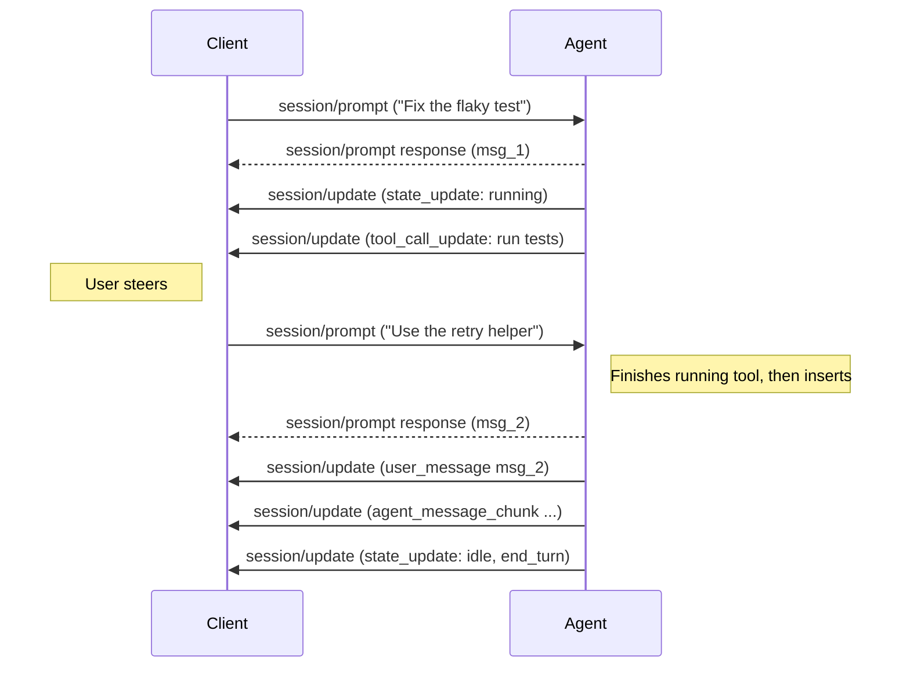

Author(s): [@uzayer](https://github.com/uzayer)

## Elevator pitch

> What are you proposing to change?

Let a user send a message to an Agent while it is still working, and have the
Agent take it into account in the current turn instead of stopping or waiting
until the turn ends.

- Define what it means for a Client to send `session/prompt` while the session
  is `running` or `requires_action`: the Agent inserts the message at its next
  safe point and keeps working.
- Advertise support with a new `session.steering` Agent capability.
- Build on the v2 [prompt lifecycle](./v2/prompt), where the prompt response
  already means "the message was inserted", not "the turn finished".

## Status quo

> How do things work today and what problems does this cause? Why would we change things?

Many agent harnesses let users type while the agent is working. Cursor, Claude
Code and Codex all show a pending message with an option to "send now" or
"steer". The message is delivered to the running turn, and the agent adjusts
course without losing the work it has already done. This is different from
pressing Esc to cancel and then sending a new prompt, which throws away the
rest of the turn and restarts it.

Model providers are also adding this directly. The OpenAI Responses API has a
[`response.steer`](https://developers.openai.com/api/docs/guides/steering)
event that queues user input for an in-progress response, finishes the current
output item and any running tools, and then continues with the new input.

ACP has no way to express steering:

- In v1, `session/prompt` lasts until the turn ends. A second prompt sent
  during a turn has no defined meaning.
- In v2, the prompt response only acknowledges insertion, which removes that
  ambiguity. But the spec only says the Client may send another prompt after
  the Agent reports `idle`. The [v2 prompt RFD](./v2/prompt) explicitly leaves
  "queueing, steering, or whether agents insert new prompts while busy" out of
  scope.

As a result, a Client that wants to offer steering has to either cancel and
resend, which loses work, or rely on agent-specific `_meta` extensions, which
don't work across Agents. Clients also cannot tell whether an Agent will
reject, queue, or steer with a prompt sent mid-turn, so they cannot show the
right UI.

This gap has already come up in the community. Goose is prototyping steering
as an ACP extension ([aaif-goose/goose#9560](https://github.com/aaif-goose/goose/pull/9560)),
and it has been discussed on Zulip in
[#general > Steering?](https://agentclientprotocol.zulipchat.com/#narrow/channel/543465-general/topic/Steering.3F/with/602495365)
and
[#general > ACP 2.0 Session Ambiguities](https://agentclientprotocol.zulipchat.com/#narrow/channel/543465-general/topic/ACP.202.2E0.20Session.20Ambiguities/with/622119441),
where the open question was whether a `session/prompt` sent while the session
is running should steer or be queued. This RFD takes the first option: a prompt
sent while the session is running is a steering message, and queueing is left
to the Client.

## What we propose to do about it

> What are you proposing to improve the situation?

This RFD targets ACP v2.

### Capability

Agents that support steering advertise it in their session capabilities:

```json
{
  "agentCapabilities": {
    "session": {
      "steering": {}
    }
  }
}
```

Omitting the key and sending `null` are equivalent, and both mean the Agent
does not support steering. Clients MUST NOT send `session/prompt` while the
session is `running` or `requires_action` unless `steering` is present.

### Sending a steering message

The Client sends an ordinary `session/prompt` while the session is `running` or
`requires_action`. No new method or field is needed.

```json
{
  "jsonrpc": "2.0",
  "id": 5,
  "method": "session/prompt",
  "params": {
    "sessionId": "sess_abc123def456",
    "prompt": [
      {
        "type": "text",
        "text": "Use the existing retry helper instead of writing a new one."
      }
    ]
  }
}
```

The Agent:

1. Keeps working. It does not cancel tools that have already started or
   rewrite output it has already sent.
2. Inserts the message into the conversation at its next safe point. What
   counts as a safe point is up to the Agent, for example after the current
   tool calls finish and before the next model request.
3. Responds to `session/prompt` with the message's `messageId` once the
   message has been inserted, as for any v2 prompt. The response may therefore
   arrive some time after the request.
4. Reports the message with a `user_message` update, so every Client shows it
   in the right place in the transcript, between the updates that came before
   and after it.
5. Continues the same foreground work. The session stays `running` and does
   not report `idle` between the original prompt and the steering message.



### Queueing stays in the Client

A queued message, one that should only be sent after the turn ends, needs no
protocol support. The Client holds it and sends it as a normal prompt when the
Agent reports `idle`. A "send now" button in the Client turns a queued message
into a steering message by sending it immediately.

## Shiny future

> How will things will play out once this feature exists?

A user asks the Agent to fix a failing test. While the Agent is reading files,
the user notices it is heading for the wrong module and types "the bug is in
`retry.rs`, not `client.rs`". They press Ctrl+Enter. The message appears in the
transcript right after the file the Agent just read, and the Agent's next step
reflects it. Nothing is cancelled and nothing is re-run.

Because this is part of the protocol, the same experience works in every
Client for every Agent that advertises `steering`. Clients that connect to an
Agent without it fall back to queueing the message until the turn ends.

## Implementation details and plan

> Tell me more about your implementation. What is your detailed implementation plan?

1. Add `steering` to the v2 `SessionCapabilities` behind an
   `unstable_session_steering` feature, regenerate the schema, and document the
   behavior in the v2 prompt lifecycle.
2. Implement it in at least one Agent adapter. Harnesses that already inject
   user messages between tool calls map onto this directly. Adapters for models with native support can forward the message,
   for example with `response.steer`.
3. Implement the Client side, including the queued / send now UI, in at least
   one Client.

## Frequently asked questions

> What questions have arisen over the course of authoring this document or during subsequent discussions?

### Does the model need to support steering?

No. An agent turn is a loop of model requests and tool calls. Between two model
requests the harness builds the next request, and it can add the user's new
message there. Any model that handles a multi-turn conversation can respond to
it. Newer models are trained to handle interruptions better, and some
providers insert the message server-side, but the protocol does not depend on
either.

### Why reuse `session/prompt` instead of adding `session/steer`?

In v2, a prompt already means "insert this user message", and the response
already means "it was inserted, here is its ID". A steering message is exactly
that, with a different insertion point. Reusing the method means message IDs,
replay, multi-client sessions and error handling all work without new rules.

### Should the Client state its intent explicitly?

This draft makes it implicit: with the capability advertised, any prompt sent
while the session is not `idle` is a steering message. An alternative is an
explicit field, such as `"delivery": "steer"`, so an Agent never has to guess
whether a prompt was meant to steer. That may matter when several Clients
share a session, or when a prompt races with the end of a turn. Feedback on
which is preferable is welcome.

### What happens if the turn ends before the message is inserted?

If foreground work finishes before the Agent reaches a safe point, the Agent
SHOULD treat the message as a normal prompt and start new foreground work with
it. The Client sees the same sequence of updates as for a prompt sent right
after `idle`.

### What happens if the Client cancels while a steering message is pending?

The Agent MUST NOT insert the pending message. It rejects the pending
`session/prompt` request with an error before reporting `idle` with the
`cancelled` stop reason. The Client can then return the text to the input box
so the user does not lose it.

### What if the Agent is waiting on a permission request?

The Agent accepts the message while in `requires_action` and inserts it at the
next safe point once work resumes. Steering does not answer or cancel the
pending permission request.

### What about several steering messages in a row?

The Agent inserts them in the order it received them, each with its own
`messageId`. If several arrive before the same safe point, it inserts them
together, one after another. Agents MAY reject a steering message with an error
if too many are pending.

### Why not support v1?

In v1, `session/prompt` stays open until the turn ends, so a second concurrent
prompt would need new rules for how the two requests relate. v2 already
separates insertion from the turn, which is what steering needs.

### What alternative approaches did you consider, and why did you settle on this one?

- **Cancel and resend:** works today, but throws away the rest of the turn and
  any work in progress, which is what users are trying to avoid.
- **A new `session/steer` method:** duplicates `session/prompt` and needs its
  own acknowledgement, ID and replay rules. See the FAQ above.
- **Queueing in the protocol:** Clients can already queue a message by holding
  it until `idle`, so a protocol-level queue adds complexity without enabling
  anything new.
- **Agent-specific `_meta` extensions:** work today, but are not portable
  across Agents, which is the problem this RFD is trying to solve.

## Revision history

- 2026-09-30: Initial draft
