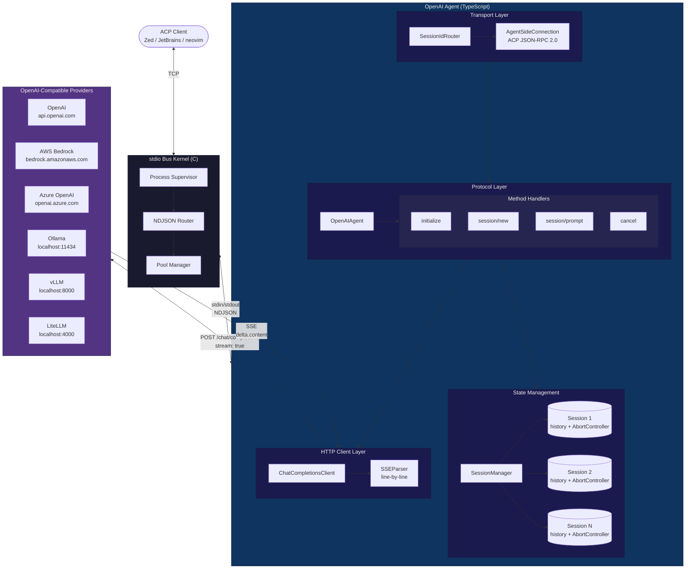

Author(s): [Raman Marozau](https://github.com/morozow)

## Elevator pitch

> What are you proposing to change?

Introduce stdio Bus — a deterministic stdio-based kernel written in C — as a new transport layer for the ACP ecosystem, along with its flagship OpenAI Agent worker that bridges ACP to any OpenAI Chat Completions API-compatible endpoint.

This addition provides:
- A low-level, deterministic routing kernel for stdio-based ACP/MCP protocols
- A universal agent that works with OpenAI, AWS Bedrock, Azure OpenAI, Ollama, vLLM, LiteLLM, and any other Chat Completions API-compatible provider
- A reference implementation demonstrating how to build production-grade ACP agents with proper session management, streaming, and cancellation

## Status quo

> How do things work today and what problems does this cause? Why would we change things?

Currently, ACP agents and clients communicate through various transport mechanisms (stdio, WebSocket, HTTP). However:

1. **No standardized low-level routing kernel**: Each agent implementation handles its own stdio communication, leading to duplicated effort and inconsistent behavior across implementations.

2. **Fragmented LLM provider support**: Developers who want to connect ACP clients to different LLM providers (OpenAI, Bedrock, Azure, local models) must either:
    - Use provider-specific agents (if they exist)
    - Build custom bridging solutions from scratch
    - Maintain multiple agent configurations for different providers

3. **Missing reference implementation**: The ecosystem lacks a well-documented, production-tested example of how to build an ACP agent with proper:
    - Multi-turn conversation state management
    - SSE streaming with cancellation support
    - Graceful shutdown handling
    - Comprehensive error handling for various HTTP failure modes

4. **Local model friction**: Running local models (Ollama, vLLM) with ACP clients requires custom integration work, limiting adoption for developers who want to experiment without API costs.

## What we propose to do about it

> What are you proposing to improve the situation?

### 1. Add stdio Bus kernel to the Registry

stdio Bus is a deterministic stdio-based kernel written in C that provides transport-level routing for ACP/MCP-style agent protocols. It acts as a process supervisor and message router, handling:

- Agent process lifecycle management
- NDJSON message framing and routing
- Session ID mapping between clients and agents
- Pool-based agent instance management

### 2. Add OpenAI Agent to the Agents list

The OpenAI Agent is a TypeScript worker that translates ACP protocol messages into OpenAI Chat Completions API calls. It supports any endpoint implementing the Chat Completions API:

| Provider | Base URL |
|----------|----------|
| OpenAI | `https://api.openai.com/v1` (default) |
| AWS Bedrock | `https://{region}.bedrock.amazonaws.com/openai/v1` |
| Azure OpenAI | `https://{resource}.openai.azure.com/openai/deployments/{deployment}` |
| Ollama | `http://localhost:11434/v1` |
| vLLM | `http://localhost:8000/v1` |
| LiteLLM | `http://localhost:4000/v1` |

### 3. Add stdio Bus to Connectors

stdio Bus serves as a transport-level connector, bridging stdio-based agents to various client environments through its TCP interface and pool management.

## Shiny future

> How will things will play out once this feature exists?

Once stdio Bus and the OpenAI Agent are part of the ACP ecosystem:

1. **Unified LLM access**: Developers can connect any ACP client (Zed, JetBrains, neovim, etc.) to any OpenAI-compatible API through a single, well-tested agent. Switching from OpenAI to Ollama or Bedrock requires only changing environment variables.

2. **Local development simplified**: Running `ollama serve` + stdio Bus gives developers a fully local ACP setup with no API keys or cloud dependencies.

3. **Production-ready reference**: The OpenAI Agent serves as a reference implementation for building ACP agents, demonstrating:
    - Proper ACP protocol handling (initialize, session/new, session/prompt, cancel)
    - Streaming response delivery via SSE
    - Per-session conversation history
    - Graceful cancellation with AbortController
    - Comprehensive error handling and logging

4. **Infrastructure foundation**: stdio Bus provides a stable foundation for building more complex agent topologies — multiple agents, load balancing, failover — without modifying individual agent implementations.

## Implementation details and plan

> Tell me more about your implementation. What is your detailed implementation plan?

### Architecture



### Message Flow

1. Registry Launcher spawns `openai-agent` as a child process with environment variables
2. stdin receives NDJSON messages from stdio Bus kernel
3. SessionIdRouter strips sessionId from incoming messages, restores it on outgoing
4. AgentSideConnection + ndJsonStream handle JSON-RPC 2.0 framing
5. OpenAIAgent dispatches to the appropriate handler (initialize, newSession, prompt, cancel)
6. On prompt: ACP content blocks are converted to OpenAI messages, ChatCompletionsClient sends POST `{baseUrl}/chat/completions` with `stream: true`
7. SSE chunks are parsed line-by-line; `delta.content` tokens are forwarded via `sessionUpdate()`
8. On stream completion (`data: [DONE]`), the full response is saved to session history

### ACP Protocol Support

| Method | Description | Status |
|--------|-------------|--------|
| `initialize` | Returns agent name, version, capabilities | ✅ Implemented |
| `session/new` | Creates session with unique ID and empty history | ✅ Implemented |
| `session/load` | Not supported (returns error) | ✅ Implemented |
| `authenticate` | No-op (returns void) | ✅ Implemented |
| `session/prompt` | Converts content → OpenAI messages, streams response | ✅ Implemented |
| `cancel` | Aborts in-flight HTTP request via AbortController | ✅ Implemented |

### Agent Capabilities

```json
{
  "protocolVersion": "2025-03-26",
  "agentInfo": { "name": "openai-agent", "version": "1.0.0" },
  "agentCapabilities": {
    "promptCapabilities": { "embeddedContext": true }
  },
  "authMethods": []
}
```

### Content Block Conversion

| ACP Block Type | OpenAI Conversion |
|----------------|-------------------|
| `text` | Text content directly |
| `resource_link` | `[Resource: {name}] {uri}` |
| `resource` | `[Resource: {uri}]\n{text}` |
| `image` | `[Image: {mimeType}]` |

### Configuration

All configuration via environment variables:

| Variable | Default | Description |
|----------|---------|-------------|
| `OPENAI_BASE_URL` | `https://api.openai.com/v1` | Base URL of the Chat Completions API endpoint |
| `OPENAI_API_KEY` | `''` (empty) | API key for authentication |
| `OPENAI_MODEL` | `gpt-4o` | Model identifier |
| `OPENAI_SYSTEM_PROMPT` | (unset) | Optional system prompt prepended to every conversation |
| `OPENAI_MAX_TOKENS` | (unset) | Optional max tokens limit |
| `OPENAI_TEMPERATURE` | (unset) | Optional temperature (float) |

### Error Handling

All errors are delivered as `agent_message_chunk` session updates followed by `{ stopReason: 'end_turn' }`:

| Condition | Error Message Pattern |
|-----------|----------------------|
| HTTP 401/403 | `Authentication error (HTTP {status}) calling {url}. Check your OPENAI_API_KEY.` |
| HTTP 429 | `Rate limit exceeded (HTTP 429) calling {url}. Please retry later.` |
| HTTP 500+ | `Server error (HTTP {status}) from {url}.` |
| Network failure | `Network error connecting to {url}: {message}` |
| Invalid SSE JSON | Logged to stderr, chunk skipped, stream continues |
| Unknown sessionId | JSON-RPC error response via ACP SDK |

### Key Design Decisions

- **Zero HTTP dependencies**: Uses native `fetch()` (Node.js 20+) instead of axios/node-fetch
- **Stateless SSE parser**: `parseLine()` is a pure function — no buffering state, easy to test
- **Per-session AbortController**: Each prompt gets a fresh AbortController via `resetCancellation()`
- **Partial responses discarded on cancel**: Incomplete assistant responses are not saved to history
- **All logging to stderr**: stdout is reserved exclusively for NDJSON protocol messages

### Test Coverage

The test suite includes 11 test files covering 5 unit test suites and 6 property-based test suites:

**Unit tests:**
- `config.test.ts` — default values, env var reading, numeric parsing
- `session.test.ts` — session creation, history management, cancellation lifecycle
- `sse-parser.test.ts` — SSE line parsing (data, done, skip, comments, invalid JSON)
- `agent.test.ts` — initialize, newSession, loadSession, authenticate, prompt
- `client.test.ts` — HTTP error classification, network errors, stream completion, cancellation

**Property-based tests (fast-check, 100+ iterations each):**
- `config.property.test.ts` — configuration round-trip, numeric env var parsing
- `session.property.test.ts` — session uniqueness, history order preservation
- `sse-parser.property.test.ts` — SSE line classification, content round-trip
- `conversion.property.test.ts` — content block conversion, request construction
- `error-handling.property.test.ts` — HTTP error classification across status code ranges
- `agent.property.test.ts` — initialize response field validation

### Documentation Changes

1. **Registry** (`docs/get-started/registry.mdx`): Add stdio Bus card with SVG logo and version `2.0.3`
2. **Clients** (`docs/get-started/clients.mdx`): Add stdio Bus to Connectors section
3. **Agents** (`docs/get-started/agents.mdx`): Add OpenAI Agent via stdio Bus worker adapter

## Frequently asked questions

> What questions have arisen over the course of authoring this document or during subsequent discussions?

### Why a separate kernel instead of integrating routing into agents?

Separation of concerns. The kernel handles process management, message routing, and transport — concerns that are orthogonal to agent logic. This allows agents to focus purely on protocol handling and LLM interaction, making them simpler to develop and test.

### Why support so many LLM providers through one agent?

The OpenAI Chat Completions API has become a de facto standard. Most providers (including Anthropic via proxies, AWS Bedrock, Azure, and local inference servers) implement this API. A single universal agent reduces maintenance burden and provides consistent behavior across providers.

### What about providers that don't support the Chat Completions API?

Additional workers can be added to the workers-registry for providers with different APIs. The architecture supports multiple agent types running under the same stdio Bus kernel.

### How does this compare to existing ACP agents like Claude Agent or Codex CLI?

Those agents are provider-specific and often include additional features (tool use, code execution). The OpenAI Agent is intentionally minimal — it's a reference implementation and a universal bridge, not a full-featured coding assistant.

### What about authentication?

The agent currently uses API key authentication via environment variables. For production deployments with multiple users, the stdio Bus kernel can be extended to support per-request authentication headers.

## Revision history

- Initial RFD creation with stdio Bus v2.0.3 and OpenAI Agent v1.4.12
